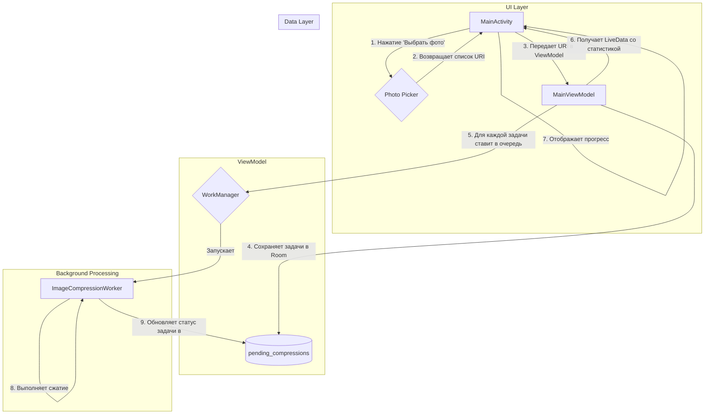

# План реализации массового сжатия изображений (Оптимизированный)

## 1. Проблема

Стандартный механизм Android `Intent.ACTION_SEND_MULTIPLE` не позволяет передавать в приложение более ~500 изображений за раз, что делает невозможным массовое сжатие тысяч фотографий. Необходимо реализовать надежный механизм для обработки 10,000+ изображений за один сеанс.

## 2. Предлагаемая архитектура (Оптимизированная)

Мы реализуем новую, полностью автономную систему массовой обработки, которая глубоко интегрируется в существующую архитектуру, используя `WorkManager` для надежного фонового выполнения.

- **`Photo Picker`**: для выбора неограниченного количества изображений.
- **База данных `Room`**: для создания персистентной и отказоустойчивой очереди задач на сжатие.
- **`WorkManager` с `ImageCompressionWorker`**: для параллельной, надежной и отказоустойчивой обработки очереди. `WorkManager` будет запускать воркеры в режиме `Foreground Service`.
- **`MainActivity`**: для отображения прогресса в реальном времени, без создания отдельного экрана.

### Диаграмма решения (Оптимизированная)

## 3. Пошаговый план реализации

### Шаг 1: Интеграция Photo Picker
- **Статус**: К выполнению.
- **Действия**:
    1.  Добавить зависимость `androidx.activity:activity-result-contracts` в `app/build.gradle.kts`.
    2.  Добавить кнопку "Массовое сжатие" в `activity_main.xml`.
    3.  В `MainActivity.kt` реализовать `ActivityResultLauncher` для `PickMultipleVisualMedia` и передавать полученный список `URI` в `MainViewModel`.

### Шаг 2: Создание базы данных Room
- **Статус**: К выполнению.
- **Действия**:
    1.  Добавить зависимости `Room` (`runtime`, `ktx`, `kapt`) в `app/build.gradle.kts`.
    2.  Создать `@Entity` `CompressionTask` со полями: `id` (PK), `uriString`, `status` (`PENDING`, `COMPLETED`, `FAILED`), `timestamp`, `failureReason`.
    3.  Создать `@Dao` `CompressionTaskDao` с методами для вставки списка задач, обновления статуса и получения `LiveData` со статистикой (количество по каждому статусу).
    4.  Создать класс `@Database` `AppDatabase`.
    5.  Настроить предоставление `AppDatabase` и `CompressionTaskDao` через Hilt в `AppModule.kt`.

### Шаг 3: Модификация `MainViewModel`
- **Статус**: К выполнению.
- **Действия**:
    1.  Создать новый метод, который принимает список `URI` от `MainActivity`.
    2.  В этом методе:
        а. Преобразовать `URI` в список объектов `CompressionTask`.
        б. Сохранить список задач в `Room` через `CompressionTaskDao`.
        в. Для каждой сохраненной задачи создать `OneTimeWorkRequest` для `ImageCompressionWorker`.
        г. Передать в `WorkRequest` `taskId` (ID из `Room`) и `uri` в `inputData`.
        д. Поставить все созданные `WorkRequest` в очередь `WorkManager`.
    3.  Добавить `LiveData`, которая будет запрашивать у `CompressionTaskDao` статистику по задачам.

### Шаг 4: Модификация `ImageCompressionWorker`
- **Статус**: К выполнению.
- **Действия**:
    1.  Добавить в `inputData` воркера обязательный параметр `taskId`.
    2.  Внедрить `CompressionTaskDao` в `ImageCompressionWorker` (Hilt это позволяет).
    3.  В `doWork()` обернуть основную логику в блок `try/catch/finally`.
    4.  В `finally` блоке **всегда** обновлять статус задачи в `Room`:
        - При успехе: установить статус `COMPLETED`.
        - При ошибке: установить статус `FAILED` и записать причину.
    5.  Реализовать `getForegroundInfoAsync()` для запуска воркера в режиме `Foreground Service`.

### Шаг 5: Интеграция UI прогресса в `MainActivity`
- **Статус**: К выполнению.
- **Действия**:
    1.  Добавить в `activity_main.xml` скрытый по умолчанию блок для отображения прогресса (например, `ProgressBar` и `TextView` для счетчиков `Выполнено: X / Y`).
    2.  В `MainActivity` подписаться на `LiveData` со статистикой из `MainViewModel`.
    3.  При запуске массовой обработки делать блок с прогрессом видимым и обновлять его данные в реальном времени.
    4.  Скрывать блок, когда все задачи в `Room` получат финальный статус (`COMPLETED` или `FAILED`).

### Шаг 6: Тестирование
- **Статус**: Спланировано.
- **Действия**:
    - **Unit-тесты**: для `CompressionTaskDao`.
    - **Интеграционные тесты**: для связки `ViewModel` -> `Room` -> `WorkManager`.
    - **Ручное тестирование (e2e)**:
        - Сценарий успешной обработки 100+ изображений.
        - Сценарий с остановкой (закрытием) приложения во время обработки и проверкой возобновления работы после перезапуска.
        - Сценарий с перезагрузкой устройства во время сжатия.
    - **Стресс-тест**: на 5,000+ изображений для проверки стабильности.