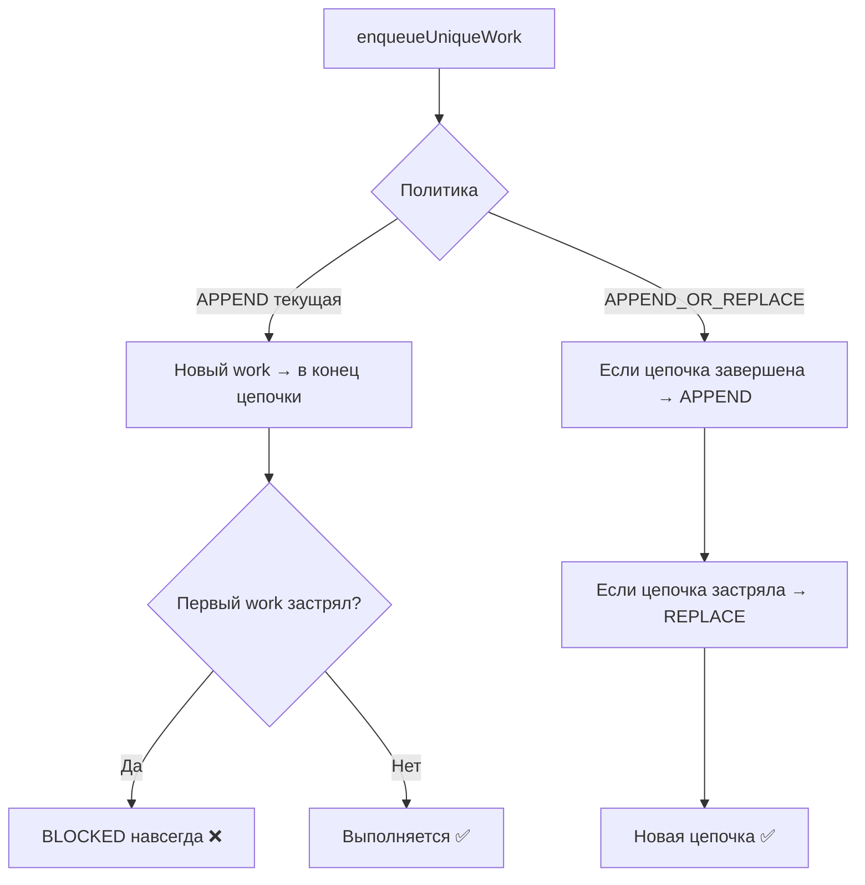

# План: Один батч-отчёт вместо нескольких при автообнаружении

---

## ✅ ЧАСТЬ 1: Batch Tracker — РЕАЛИЗОВАНО

### Статус: ВЫПОЛНЕНО, собрано успешно (assembleDebug BUILD SUCCESSFUL)

**Что было сделано:**

1. ✅ Добавлено поле `createdAt: Long` в `CompressionBatch` data class
2. ✅ Заменён фиксированный `AUTO_BATCH_TIMEOUT_MS = 30000L` на три константы:
   - `AUTO_BATCH_IDLE_TIMEOUT_MS = 20000L` — idle после последнего `addResult()`
   - `AUTO_BATCH_MAX_LIFETIME_MS = 600000L` — максимальное время жизни автобатча (10 мин)
   - `INTENT_BATCH_TIMEOUT_MS = 30000L` — таймаут для Intent-батчей (без изменений)
3. ✅ `addResult()` теперь продлевает idle-таймаут для автобатчей при каждом результате
4. ✅ `getOrCreateAutoBatch()` ищет активный батч с проверкой `MAX_LIFETIME`
5. ✅ `extendAutoBatchTimeout()` и `cleanupOldBatches()` обновлены
6. ✅ Удалён мёртвый `getBatchTimestamp()` метод
7. ✅ Тесты `CompressionBatchTrackerTest.kt` обновлены
8. ✅ Code review выполнен, замечания исправлены (idle timeout увеличен с 10s → 20s)
9. ✅ `assembleDebug` BUILD SUCCESSFUL

**Изменённые файлы:**
- `app/src/main/java/com/compressphotofast/util/CompressionBatchTracker.kt`
- `app/src/test/java/com/compressphotofast/util/CompressionBatchTrackerTest.kt`

---

## ❌ ЧАСТЬ 2: Workers не запускаются — ОТДЕЛЬНАЯ ПРОБЛЕМА

### Диагноз

Анализ LOG.txt выявил, что **ни один Worker не выполнил `doWork()`**, несмотря на успешный enqueue:

```
21:37:17.871  Создан автобатч: auto_batch_1_1780425437869
21:37:17.983  Запущена работа по сжатию для .../280459 (batch_1)
21:37:17.983  Запущена работа по сжатию для .../280458 (batch_1)
... (24 worker'а enqueued за 1.5 сек)
21:37:38.211  Истёк таймаут → Пустой батч auto_batch_1
```

**80 workers** были enqueued, **0 выполнили `doWork()`**, **3 батча таймаутились пустыми**.

### Корневая причина

`ExistingWorkPolicy.APPEND` в `ImageProcessingUtil.kt` (строка 109):

```kotlin
WorkManager.getInstance(context)
    .enqueueUniqueWork(
        "sequential_image_compression",   // единая цепочка
        ExistingWorkPolicy.APPEND,         // ← ПРОБЛЕМА
        compressionWorkRequest
    )
```

**APPEND означает**: если в цепочке `sequential_image_compression` есть хоть один застрявший (ENQUEUED/RUNNING/BLOCKED) work от предыдущей сессии, **все новые works будут BLOCKED навсегда**.

WorkManager переживает перезапуск приложения — старые works из предыдущей сессии остаются в БД WorkManager. Если приложение было убито или перезагружено во время выполнения worker'а, его статус может застрять в RUNNING, блокируя всю цепочку.

### Решение: Замена APPEND → APPEND_OR_REPLACE



### Шаги реализации

#### Шаг 1: Заменить `ExistingWorkPolicy.APPEND` на `APPEND_OR_REPLACE`

**Файл**: `app/src/main/java/com/compressphotofast/util/ImageProcessingUtil.kt`, строка 109

```kotlin
// Было:
ExistingWorkPolicy.APPEND,

// Стало:
ExistingWorkPolicy.APPEND_OR_REPLACE,
```

**Почему APPEND_OR_REPLACE, а не REPLACE:**
- `REPLACE` — отменяет ВСЕ существующие works и заменяет новыми. Прерывает текущий работающий worker.
- `APPEND_OR_REPLACE` — если цепочка завершена (все works SUCCEEDED/FAILED), добавляет в конец. Если цепочка застряла (ENQUEUED/RUNNING/BLOCKED), заменяет всю цепочку. **Идеально для нашего случая** — не прерывает активный worker, но лечит застрявшие цепочки.

#### Шаг 2: Добавить диагностику WorkManager при enqueue

**Файл**: `ImageProcessingUtil.kt`, после строки ~112 (после `enqueueUniqueWork`)

Добавить логирование состояния цепочки для диагностики:

```kotlin
// Диагностика: проверяем состояние цепочки после enqueue
try {
    val workInfos = WorkManager.getInstance(context)
        .getWorkInfosForUniqueWork("sequential_image_compression")
        .get()
    
    val blocked = workInfos.count { it.state == WorkInfo.State.BLOCKED }
    val enqueued = workInfos.count { it.state == WorkInfo.State.ENQUEUED }
    val running = workInfos.count { it.state == WorkInfo.State.RUNNING }
    val succeeded = workInfos.count { it.state == WorkInfo.State.SUCCEEDED }
    val failed = workInfos.count { it.state == WorkInfo.State.FAILED }
    
    LogUtil.processDebug("WorkManager цепочка: S=$succeeded F=$failed R=$running E=$enqueued B=$blocked (всего ${workInfos.size})")
} catch (e: Exception) {
    LogUtil.processDebug("WorkManager: не удалось получить состояние цепочки")
}
```

#### Шаг 3: Добавить лог начала `doWork()` в ImageCompressionWorker

**Файл**: `app/src/main/java/com/compressphotofast/worker/ImageCompressionWorker.kt`, в начале `doWork()`

```kotlin
override suspend fun doWork(): Result = withContext(Dispatchers.IO) {
    LogUtil.processDebug("ImageCompressionWorker.doWork() НАЧАЛО: ${inputData.getString(Constants.WORK_INPUT_IMAGE_URI)}")
    var testResult: ImageCompressionUtil.CompressionTestResult? = null
    // ... остальной код
```

Это позволит в логах видеть, что worker реально стартовал, и диагностировать проблемы дальше.

#### Шаг 4: (Опционально) Очистка WorkManager при запуске приложения

**Файл**: `MainActivity.kt` или класс Application

Добавить при запуске приложения:
```kotlin
// Очистка застрявших works от предыдущей сессии
val workManager = WorkManager.getInstance(this)
val workInfos = workManager.getWorkInfosForUniqueWork("sequential_image_compression").get()
val stuckWorks = workInfos.filter { 
    it.state == WorkInfo.State.ENQUEUED || it.state == WorkInfo.State.RUNNING 
}
if (stuckWorks.size > 50) {
    LogUtil.processDebug("Очистка ${stuckWorks.size} застрявших works при запуске")
    workManager.cancelUniqueWork("sequential_image_compression")
}
```

---

## Файлы для изменения

| Файл | Изменение | Часть |
|---|---|---|
| `CompressionBatchTracker.kt` | ✅ Реализовано: таймаут, addResult(), константы | Часть 1 |
| `CompressionBatchTrackerTest.kt` | ✅ Реализовано: новые тесты | Часть 1 |
| `ImageProcessingUtil.kt` | Замена `APPEND` → `APPEND_OR_REPLACE` + диагностика | Часть 2 |
| `ImageCompressionWorker.kt` | Добавить лог в начале `doWork()` | Часть 2 |
| `MainActivity.kt` (опционально) | Очистка застрявших works при запуске | Часть 2 |

## Риски и защита

| Риск | Защита |
|---|---|
| Worker завис → батч ждёт бесконечно | `AUTO_BATCH_MAX_LIFETIME_MS = 10 мин` — принудительная финализация |
| APPEND_OR_REPLACE прервёт активный worker | Нет — APPEND_OR_REPLACE прерывает только застрявшие цепочки |
| Старые застрявшие works блокируют новые | APPEND_OR_REPLACE автоматически лечит |
| Много застрявших works при запуске | Опциональная очистка при старте приложения |

## Логика процесса

### Batch Tracker (реализовано)
1. **Создание автобатча**: `getOrCreateAutoBatch()` создаёт батч с `createdAt = now()` и idle-таймаутом 20 сек
2. **Накопление результатов**: каждый `addResult()` продлевает таймаут на 20 сек (если не превышен MAX_LIFETIME)
3. **Финализация**: таймаут срабатывает когда 20 сек не было новых результатов → `processBatch()` → один полный отчёт
4. **Защита**: если батч живёт дольше 10 мин, таймаут не продлевается → принудительная финализация

### Worker Execution (планируется)
1. **APPEND_OR_REPLACE**: если цепочка `sequential_image_compression` завершена → APPEND, если застряла → REPLACE
2. **Диагностика**: логирование состояния цепочки при каждом enqueue
3. **Лог doWork()**: явный лог при входе в worker для быстрой диагностики
