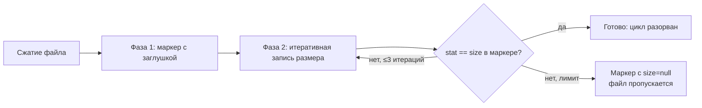

# Фикс: бесконечный цикл «тестового пересжатия» из-за неверного размера в EXIF-маркере

## Диагноз (подтверждён log.txt)

`rewriteMarkerWithActualSize` (ExifUtil.kt:1007-1081) фиксирует размер файла **до** собственного
`exif.saveAttributes()`. На практике `ExifInterface.saveAttributes()` пересобирает EXIF-сегменты и
**меняет размер файла** (в логе: +966 байт после первого сжатия, +138 байт после каждой перезаписи
маркера). Итог: размер в маркере ≠ фактическому размеру → `ImageProcessingChecker` (строки 230-242)
классифицирует файл как «изменён после сжатия» → повторная обработка → `testCompression` неэффективен
(экономия −1%) → `handleInefficientSkip` перезаписывает маркер с quality=99 → размер снова
расходится → **бесконечный цикл** (log.txt: 3581 → 3626 → 3685 → 3755 → 4009 → 4136).

Допущение в комментариях ExifUtil.kt:945-947 и 998-1005 («повторная запись EXIF не меняет размер
файла», «строка маркера сохраняет длину») — эмпирически ложно.

## Решение

Итеративная стабилизация размера в маркере + безопасная деградация.

### Изменения в `app/src/main/java/com/compressphotofast/util/ExifUtil.kt`

1. **Новый private helper `getActualFileSizeOnDisk(context, uri): Long?`**
   - Размер напрямую с диска: `contentResolver.openFileDescriptor(uri, "r")` + `Os.fstat(fd).st_size`
     (в try/catch, fallback: `AssetFileDescriptor.length`).
   - Не использовать `UriUtil.getFileSize` (MediaStore `OpenableColumns.SIZE` может быть устаревшим
     до рескана — второй источник рассинхрона).

2. **`rewriteMarkerWithActualSize`: итеративная сверка**
   - Цикл до 3 итераций:
     a. `size = getActualFileSizeOnDisk()`; если null/≤0 — оставить заглушку (null), вернуть false
        (парсер уже трактует это как «размер неизвестен» → файл пропускается — безопасно).
     b. Записать маркер с `size` (существующий механизм с backup/restore/verify сохраняется).
     c. `actual = getActualFileSizeOnDisk()`; если `actual == size` — успех, выйти.
   - Если за 3 итерации не стабилизировалось — последняя попытка: записать маркер с size=null
     (заглушка), чтобы гарантированно разорвать цикл (файл будет пропущен как «неизвестный размер»).
   - Логировать каждую итерацию (`размер до=X, после=Y`).

3. **Обновить ложные комментарии** (строки ~945-947, ~998-1005, ~1063) — описать реальное поведение
   `saveAttributes()` и итеративную стратегию.

4. **Финальная верификация в `applyExifFromMemory`** (после фазы 2, блок строк 959-967): вместе с
   проверкой `marker.isCompressed` дополнительно проверить при `marker.fileSize != null`, что
   `getActualFileSizeOnDisk() == marker.fileSize`; при несоответствии — логировать error (диагностика
   внешних модификаторов файла).

### Не менять

- Семантику `ImageProcessingChecker` (проверка `markerFileSize != fileSize` корректна — проблема в
  записи, не в чтении).
- `handleInefficientSkip` и маркер quality=99 — это следствие, не причина.
- Формат маркера и двухфазную запись (фиксированная ширина size сохраняется).

## Логика процесса (порядок выполнения)

## План работ

1. Добавить `getActualFileSizeOnDisk` в `ExifUtil.kt`.
2. Переделать `rewriteMarkerWithActualSize` на итеративный алгоритм с деградацией на size=null.
3. Добавить пост-проверку `stat == marker.fileSize` в `applyExifFromMemory`.
4. Обновить комментарии.
5. Unit-тесты (Robolectric, `ExifUtilTest` / новый тест-класс):
   - после `markCompressedImage`/`applyExifFromMemory` маркерный размер == фактическому размеру
     файла на диске;
   - при несовпадении после первой итерации вторая итерация сходится;
   - деградация на size=null при невозможности стабилизации (мок/нестабильный размер).
6. Сборка `./gradlew assembleDebug`, unit-тесты `./gradlew testDebugUnitTest` через навык
   `android-test-suite`.
7. Обновить AGENTS.md (`agents-updater`) и опубликовать APK (навык `apk`) — runtime-код меняется.
8. Валидация на устройстве: два последовательных сканирования — в логе отсутствует
   «Файл изменён после сжатия» для только что сжатых файлов; маркер не перезаписывается на 99.

## Риски

- `Os.fstat` требует API 21+ (minSdk 29 — ок); обернуть в try/catch с fallback.
- Чрезмерные итерации записи EXIF: лимит 3 + деградация на null исключают цикл.
- Внешние модификаторы файла (галерея/облако после записи) — не лечится итерациями, но
  пост-проверка в п.3 залогирует источник расхождения.
