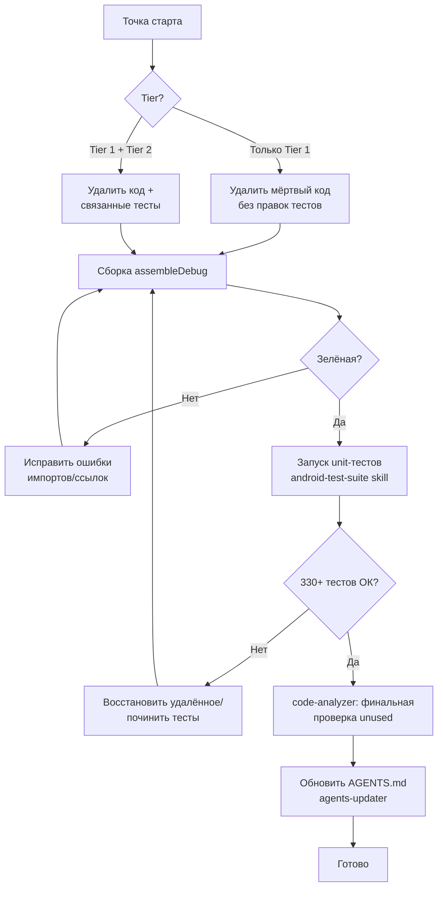

# План: Очистка мёртвого кода (v3, scope=unused)

## Контекст

Анализ `scope=unused` выполнен по всем 34 Kotlin-файлам `app/src/main/java` (подход Glob/Grep/Read,
без `Task(Explore)` согласно правилам скилла `code-analyzer`). Проверены: использование каждой
публичной функции, каждого поля/константы `Constants`, приватных функций, deprecated-compat методов,
а также раздутого API интерфейсов. Для каждого кандидата проверено использование И в main, И в test.

Цель: удалить код, не использующийся в production. Разделены два уровня уверенности.

---

## 📊 Сводка находок

| Категория | Кол-во элементов | Уверенность |
|-----------|------------------|-------------|
| Мёртвый код (не используется нигде, даже в тестах) | 5 групп | 🟢 Высокая |
| Test-only код (production = 0, только в тестах) | ~25 элементов | 🟡 Средняя (требует решения) |

---

## 🟢 Tier 1 — Мёртвый код (безопасно удалить, не ломает тесты)

### 1.1 `Constants.kt` — полностью неиспользуемая константа
- `PREF_COMPRESSION_PRESET` (`compression_preset`) — **0 ссылок** во всём проекте (main + test).
- **Действие:** удалить строку.

### 1.2 `MainViewModel.kt` — never-populated карта observers
- Поле `workObservers: MutableMap<UUID, Observer<WorkInfo?>>` **никогда не заполняется**
  (нет ни одного `workObservers[...] = `). Следовательно весь блок очистки в `onCleared()`
  (цикл `forEach` + `clear()`) — мёртвый.
- После удаления поля и блока становятся неиспользуемыми импорты:
  `androidx.lifecycle.Observer`, `androidx.work.WorkInfo`, `java.util.UUID`
  (проверить, что они не нужны в других частях файла — они не нужны).
- **Действие:** удалить поле `workObservers`, упростить `onCleared()` до `super.onCleared()`,
  убрать 3 неиспользуемых импорта.

### 1.3 `CompressionBatchTracker.kt` — deprecated-compat слой (частично мёртв)
Используется только `getOrCreateAutoBatchCompat` (через `ImageProcessingUtil`).
Мёртвые `@Deprecated` static-методы (0 вызовов в main И test):
- `createIntentBatchCompat`
- `addResultCompat`
- `finalizeBatchCompat`
- `getActiveBatchCountCompat`
- `clearAllBatchesCompat`

Связанные instance-методы, которые после этого теряют единственных вызывателей
(проверить тесты `CompressionBatchTrackerTest` — если покрывают, оставить; иначе удалить):
- `getActiveBatchCount()` (используется только `getActiveBatchCountCompat`)
- `clearAllBatches()` (используется только `clearAllBatchesCompat` + возможно тесты)

> `getInstance(context)` и `staticInstance` **оставить** — нужны для `getOrCreateAutoBatchCompat`.
- **Действие:** удалить 5 неиспользуемых compat-методов; проверить и, при отсутствии тестов,
  удалить `getActiveBatchCount()`/`clearAllBatches()`.

### 1.4 `StatsTracker.kt` — неиспользуемая константа
- `COMPRESSION_STATUS_NONE = 0` — **0 ссылок** (остальные статусы используются).
- **Действие:** удалить строку.

### 1.5 `ImageProcessingChecker.kt` — осиротевший KDoc
- Строки 296–300: блок документации `/** Проверка MIME типа на поддержку ... */`,
  висящий над `data class ProcessingCheckResult` (метод, который он документировал, удалён).
- **Действие:** удалить осиротевший комментарий.

---

## 🟡 Tier 2 — Test-only код (НЕ к выполнению — справочно)

> Записано для будущего рассмотрения. Production = 0, но покрыто юнит-тестами.
> Удаление потребует одновременного удаления соответствующих assert'ов/тестов.

### 2.1 `Constants.kt` — константы, подтверждаемые только `ConstantsTest`
(production не использует; только `assertEquals` в тестах):
- `REQUEST_CODE_DELETE_FILE`, `REQUEST_CODE_DELETE_PERMISSION`
- `DEFAULT_COMPRESSION_QUALITY`, `MIN_COMPRESSION_QUALITY`, `MAX_COMPRESSION_QUALITY`
- `MIN_COMPRESSION_RATIO`
- `NOTIFICATION_CHANNEL_ID` (в production channel id берётся из string-resource
  `notification_channel_id`; константа дублирует строку и не используется)

### 2.2 `PerformanceMonitor.kt` — методы-измерители без вызовов в production
(покрыты только `PerformanceMonitorTest`):
- `measureIndividualMetadata` (+ поля `individualMetadataRequests`, `individualMetadataTime`)
- `measureDirectoryCheck` (+ поле `directoryCheckTime`)
- `measureMimeTypeCheck` (+ поле `mimeTypeCheckTime`)
- При удалении убрать мёртвые поля и строки из `resetStats()`/`getDetailedStats()`.

### 2.3 `SettingsManager.kt` / `SettingsEditor` — методы, оставшиеся от удалённых фич
(flow удаления, first-launch, batch-update). Production = 0, только в
`SettingsManagerTest`/`SettingsManagerBatchTest`/`SettingsManagerToastTest`:
- `getSaveMode()`, `savePendingDeleteUri()`, `getAndRemoveFirstPendingDeleteUri()`,
  `getPendingDeleteUris()`
- `isFirstLaunch()` / `setFirstLaunch()`
- `isDeletePermissionRequested()` / `setDeletePermissionRequested()`
- `setProcessScreenshots()` (getter `shouldProcessScreenshots()` **оставить** — используется)
- `setShowCompressionToast()` (getter `shouldShowCompressionToast()` **оставить**)
- `batchUpdate()` + весь класс `SettingsEditor`
- Связанные константы `PREF_PENDING_DELETE_URIS`, `PREF_FIRST_LAUNCH`,
  `PREF_DELETE_PERMISSION_REQUESTED` — проверить, не нужны ли иначе; удалить вместе.

### 2.4 `IPermissionsManager.kt` / `PermissionsManager.kt` — неиспользуемые члены интерфейса
Из методов интерфейса в `MainActivity` реально вызываются только:
`checkAndRequestAllPermissions`, `hasMediaLocationPermission`, `requestOtherPermissions`,
`showPermissionExplanationDialog`, `hasStoragePermissions`.
Неиспользуемые снаружи (мёртвые как контракт):
- `requestStoragePermissions(...)` — нет внешних вызовов, override не вызывается внутри класса.
- `handlePermissionResult(requestCode, permissions, grantResults, ...)` (5-параметровая) —
  public override не вызывается нигде (launcher использует приватную 2-параметровую версию).
- **Действие:** удалить из интерфейса И реализации (согласовать с тем, что dialog/handler
  методы `requestNotificationPermission`, `showStoragePermissionDialog`,
  `showNotificationPermissionExplanation` оставить — они вызываются внутренне).

---

## 🔄 Логика процесса (workflow выполнения)

**Принципы безопасности:**
1. Каждый файл правится точечно (Edit), сохраняя логику остальных методов.
2. Перед удалением любого test-only элемента — grep-проверка, что он действительно не используется
   в production (правило: `app/src/main` = 0 ссылок).
3. Удаляемые константы/методы из Tier 2 сопровождаются удалением соответствующих assert'ов в тестах.
4. После каждой группы правок — `./gradlew assembleDebug` для раннего обнаружения битых ссылок.
5. Финальная проверка — unit-тесты через скилл `android-test-suite` (только unit, ~10 мин).

---

## ✅ Пошаговый план реализации (объём: ТОЛЬКО Tier 1)

> Решение пользователя: выполнять **только Tier 1** (мёртвый код, не трогая тесты).
> Tier 2 (раздел ниже) оставлен как справка и к выполнению НЕ планируется.

### Шаг 1 — Удаление мёртвого кода (Tier 1)
1. `Constants.kt`: удалить `PREF_COMPRESSION_PRESET` (полностью неиспользуемая).
2. `StatsTracker.kt`: удалить `COMPRESSION_STATUS_NONE` (0 ссылок).
3. `ImageProcessingChecker.kt`: удалить осиротевший KDoc (строки ~296–300, над `ProcessingCheckResult`).
4. `MainViewModel.kt`: удалить поле `workObservers`, упростить `onCleared()` до `super.onCleared()`,
   убрать ставшие неиспользуемыми импорты `androidx.lifecycle.Observer`, `androidx.work.WorkInfo`,
   `java.util.UUID`.
5. `CompressionBatchTracker.kt`: удалить 5 неиспользуемых `@Deprecated` compat-методов
   (`createIntentBatchCompat`, `addResultCompat`, `finalizeBatchCompat`,
   `getActiveBatchCountCompat`, `clearAllBatchesCompat`). Перед удалением `getActiveBatchCount()`/
   `clearAllBatches()` instance-методов — проверить `CompressionBatchTrackerTest`: если они покрыты
   тестами напрямую, **оставить** (это уже Tier 2-категория, не трогаем).

### Шаг 2 — Сборка
- `./gradlew assembleDebug` → должна быть зелёной. При ошибках импортов/ссылок — точечно исправить.

### Шаг 3 — Тесты
- Запустить unit-тесты через скилл `android-test-suite` (по умолчанию только unit, ~10 мин).
- Ожидаемый результат: все 330 тестов проходят (тесты не затрагиваются Tier 1).

### Шаг 4 — Финальная проверка
- Опционально: `/code-analyzer scope=unused` для подтверждения, что удалённые элементы исчезли.

### Шаг 5 — Документация
- Обновить `AGENTS.md` через скилл `agents-updater` (раздел «Текущий фокус»: отметить новую
  итерацию очистки мёртвого кода в списке незакоммиченных изменений).

---

## ⚠️ Зоны, требующие внимания при выполнении
- **Не прочитаны до конца** (возможны дополнительные неиспользуемые приватные функции/импорты):
  `MainActivity.kt`, `NotificationUtil.kt`, `MediaStoreUtil.kt`, `GalleryScanUtil.kt`,
  `ImageCompressionWorker.kt`, остаток `ImageCompressionUtil.kt`, `BackgroundMonitoringService.kt`,
  `ImageDetectionJobService.kt`, `BootCompletedReceiver.kt`. На шаге выполнения сделать
  финальный grep-проход по приватным функциям этих файлов и по неиспользуемым импортам
  (IDE-инспекция / `./gradlew compileDebugKotlin -W`).
- Удаление deprecated-методов `CompressionBatchTracker` — проверить, что `getOrCreateAutoBatchCompat`
  и `getInstance` остаются (они живые).
- `NOTIFICATION_CHANNEL_ID`: убедиться, что нигде не используется через reflection/manifest
  (используется только string-resource `notification_channel_id`).

---

## ❓ Открытый вопрос пользователю
Решён: выполнять **только Tier 1** (см. раздел «Пошаговый план реализации»).
