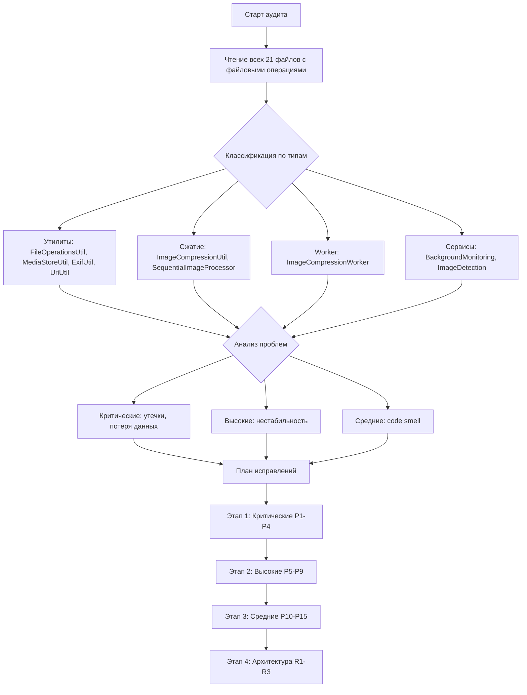

# План: Аудит надёжности файловых операций Android-приложения

## Область аудита

Полная проверка логики работы с файлами в `app/src/main/java/com/compressphotofast/`.  
Анализируются 21 файл с файловыми операциями из 38 Kotlin-файлов проекта.

---

## Обнаруженные проблемы

### 🔴 КРИТИЧЕСКИЕ (могут привести к потере данных)

#### P1. Временные файлы НЕ очищаются — утечка дискового пространства
**Файлы:** `TempFilesCleaner.kt`, `MediaStoreUtil.kt`, `ExifUtil.kt`

`TempFilesCleaner` очищает только файлы с префиксами `temp_image_*`, `input_*`, `*.jpg`, `*.jpeg`.  
Но в коде создаются также:
- `stream_cache*.tmp` — в `MediaStoreUtil.resetOrCopy()` (строка 821, 830)
- `exif_backup_*.jpg` — в `ExifUtil.applyExifFromMemory()` (строка 860)

Эти файлы удаляются только в `finally`-блоках. Если процесс завершается аварийно (OOM kill, ANR, crash), они остаются навсегда.

**Решение:** Добавить маски `stream_cache*`, `exif_backup_*` в фильтры `TempFilesCleaner.cleanupTempFiles()`.

---

#### P2. `UriUtil.getFileSize()` — ненадёжный fallback через `inputStream.available()`
**Файл:** `UriUtil.kt` строки 437-439

```kotlin
context.contentResolver.openInputStream(uri)?.use { inputStream ->
    val available = inputStream.available()
    return@withContext if (available >= 0) available.toLong() else 0L
}
```

`InputStream.available()` не возвращает размер файла — это оценка байт, доступных для чтения без блокировки. Для `ContentResolver` InputStream это обычно 0 или небольшое число. Это может приводить к тому, что:
- Файл считается слишком маленьким и пропускается
- Проверка `isImageProcessingEfficient()` получает некорректный `originalSize`

**Решение:** Заменить на полное чтение потока с подсчётом байт (через `copyTo(OutputStream.nullOutputStream())` или `inputStream.readBytes().size`), либо использовать `DocumentFile.length()` как fallback.

---

#### P3. Потеря данных при fallback в `MediaStoreUtil.saveCompressedImageFromStreamInternal()`
**Файл:** `MediaStoreUtil.kt` строки 601-626

```kotlin
val updateSuccess = safeUpdateExistingFile(context, uri, inputStream)
if (!updateSuccess) {
    // Fallback: пытаемся создать новый файл
    val fallbackResult = createMediaStoreEntry(...)
    context.contentResolver.openOutputStream(fallbackResult)?.use { outputStream ->
        inputStream.resetOrCopy(context).use { resetStream ->
            resetStream.copyTo(outputStream)
        }
    }
}
```

Если `safeUpdateExistingFile()` уже частично прочитал `inputStream` перед ошибкой, `resetOrCopy()` не сможет восстановить данные (mark/reset не поддерживается большинством InputStream). Результат: fallback создаёт пустой или неполный файл.

**Решение:** Передавать в `safeUpdateExistingFile()` копию данных (через `ByteArrayOutputStream`), а не оригинальный поток. Или буферизировать данные перед первым вызовом.

---

#### P4. `hasEnoughDiskSpace()` / `hasEnoughMemory()` возвращают `true` при ошибке
**Файл:** `FileOperationsUtil.kt` строки 284-288, 319-322

```kotlin
} catch (e: Exception) {
    LogUtil.errorWithException("Проверка дискового пространства", e)
    true // fail-safe
}
```

Если проверка ресурсов падает, операция продолжается как будто ресурсы есть. На устройствах с малым объёмом памяти или заполненным диском это может привести к:
- OOM crash при декодировании Bitmap
- Повреждению файлов при нехватке дискового пространства
- Созданию усечённых файлов в MediaStore

**Решение:** Вернуть `false` при ошибке (fail-closed). Лучше пропустить сжатие, чем потерять данные.

---

### 🟡 ВЫСОКИЕ (могут вызывать нестабильность)

#### P5. Dead code в `MediaStoreUtil.saveCompressedImageFromStreamInternal()`
**Файл:** `MediaStoreUtil.kt` строка 689

```kotlin
return@withContext uri  // НЕДОСТИЖИМЫЙ КОД
```

Обе ветки (isUpdateMode = true/false) содержат `return@withContext` внутри try-блока. Строка 689 никогда не выполняется. Это не ошибка, но маскирует возможные проблемы с логикой.

**Решение:** Удалить unreachable строку, или переписать метод для ясности.

---

#### P6. ExifUtil.applyExifFromMemory() — создание backup молча игнорирует ошибки
**Файл:** `ExifUtil.kt` строки 862-869

```kotlin
try {
    context.contentResolver.openInputStream(uri)?.use { input ->
        FileOutputStream(backupFile).use { output ->
            input.copyTo(output)
        }
    }
} catch (e: Exception) {
    LogUtil.warning(uri, "EXIF backup", "Не удалось создать backup: ${e.message}")
}
```

Если backup не создан, но `saveAttributes()` повреждает файл (известная проблема на некоторых Samsung/Huawei устройствах), восстановление невозможно. Код продолжит запись EXIF без страховки.

**Решение:** Если backup не удалось создать, записать warning и пропустить `saveAttributes()` (установить только compression marker, если возможно).

---

#### P7. UriUtil.getFilePathFromUri() — fallback возвращает content:// URI как путь
**Файл:** `UriUtil.kt` строка 120

```kotlin
return effectiveUri.toString()  // "content://media/external/images/media/123"
```

На Android 10+, если запрос к MediaStore не удался, возвращается строковое представление content-URI. Это не валидный файловый путь и может вызывать проблемы в коде, который ожидает реальный путь (например, `FileOperationsUtil.isScreenshot()` использует `lowercase()` и `contains()` — это сработает, но другие проверки могут сломаться).

**Решение:** Возвращать `null` вместо строки URI, и обрабатывать `null` во всех вызывающих методах.

---

#### P8. ImageCompressionWorker — дубликаты при retry после неудачного удаления
**Файл:** `ImageCompressionWorker.kt` строки 384-404

Когда удаление оригинала не удалось после успешного сжатия, Worker возвращает `Result.failure()`. WorkManager может повторить задачу, создав ЕЩЁ ОДИН сжатый файл. Результат: дубликаты в галерее.

**Решение:** Использовать `Result.success()` даже при неудачном удалении, показывая уведомление об ошибке удаления. Или использовать уникальный WorkManager tag для предотвращения повторного запуска.

---

#### P9. ConcurrentHashMap fileSaveLocks — некорректная очистка
**Файл:** `MediaStoreUtil.kt` строки 44-52

```kotlin
if (fileSaveLocks.size > MAX_SAVE_LOCKS) {
    val toRemove = fileSaveLocks.entries
        .filter { !it.value.isLocked }
        .take(fileSaveLocks.size - MAX_SAVE_LOCKS / 2)
        .map { it.key }
    toRemove.forEach { fileSaveLocks.remove(it) }
}
```

Проблемы:
1. Между проверкой `size > MAX_SAVE_LOCKS` и удалением, другой поток может добавить записи
2. `filter { !it.value.isLocked }` — состояние `isLocked` может измениться между проверкой и удалением
3. Удаление незалоченных мьютексов безопасно, но при высокой нагрузке мьютексы могут быть удалены пока другой поток ждёт `withLock`

**Решение:** Заменить на ограниченный кэш (например, использовать `LinkedHashMap` с `removeEldestEntry`), или использовать периодическую очистку вместо inline.

---

### 🟢 СРЕДНИЕ (косметические/улучшения)

#### P10. TempFilesCleaner — слишком широкий фильтр `*.jpg`
**Файл:** `TempFilesCleaner.kt` строка 35

Фильтр `file.name.endsWith(".jpg")` удалит ЛЮБОЙ .jpg файл старше 30 минут в cacheDir. Хотя вероятность конфликта мала, это может затронуть файлы, созданные другими компонентами.

**Решение:** Использовать более точные префиксы (`temp_image_`, `compressed_`, `stream_cache_`, `exif_backup_`).

---

#### P11. StreamExtensions.toInputStream() — создаёт копию данных
**Файл:** `StreamExtensions.kt`

`toByteArray()` создаёт полную копию данных. Для больших изображений (20+ MB) это удваивает потребление памяти. Комментарий в файле объясняет почему это необходимо (shared buffer mutation), но стоит рассмотреть альтернативы.

**Решение:** Оставить как есть (безопасность важнее памяти), но добавить комментарий с размером данных для мониторинга.

---

#### P12. ImageCompressionWorker — testResult.compressedStream закрывается дважды
**Файл:** `ImageCompressionWorker.kt` строки 313, 504

```kotlin
// Строка 313
compressedImageStream.use { stream -> ... }  // Закрывает поток
// Строка 504 в finally
testResult?.compressedStream?.close()  // Закрывает повторно
```

Для `ByteArrayOutputStream` это безопасно (повторное закрытие — no-op), но это code smell.

**Решение:** Убрать `close()` из finally, так как `.use` уже закрывает поток. Или не использовать `.use` и оставить только finally-close.

---

#### P13. MediaStoreUtil.saveCompressedImageToGallery() — двойной вызов clearIsPendingFlag
**Файл:** `MediaStoreUtil.kt` строки 499, 520

В update-режиме `clearIsPendingFlag()` вызывается на строке 499, а затем ещё раз на строке 520 (для всех режимов). Это не ошибка (повторная установка IS_PENDING=0 безопасна), но лишняя операция ввода-вывода.

**Решение:** Вынести `clearIsPendingFlag()` после if/else, убрать вызов внутри if-ветки update-режима.

---

#### P14. ImageCompressionUtil.compressStream() — не оптимальный inSampleSize
**Файл:** `ImageCompressionUtil.kt` строки 541-571

`compressStream()` не вычисляет `inSampleSize` и не использует `decodeImageBounds()` перед декодированием. Для больших изображений это может привести к OOM.

**Решение:** Добавить двухпроходное декодирование (bounds → decode) аналогично `compressImageToStream()`.

---

#### P15. Hardcoded задержки в EXIF обработке
**Файлы:** `ExifUtil.kt` строки 1214, 1229; `MediaStoreUtil.kt` строка 661

```kotlin
delay(300)  // Перед EXIF copy
delay(100)  // Перед верификацией
delay(300)  // Android 11
```

Задержки помогают на некоторых устройствах, но замедляют обработку на устройствах, где они не нужны.

**Решение:** Вынести задержки в конфигурируемые константы, или использовать exponential backoff вместо фиксированных значений.

---

## Архитектурные рекомендации

### R1. Централизованный менеджер временных файлов
Создать единый `TempFileManager`, который:
- Регистрирует все созданные временные файлы
- Гарантированно очищает их при завершении операции
- Периодически扫描 cacheDir для удаления осиротевших файлов

### R2. Целостность данных: write-ahead подход
Вместо «сжатие → сохранение → удаление оригинала» использовать:
1. Сжать в temp файл
2. Верифицировать temp файл
3. Сохранить через MediaStore
4. Верифицировать сохранённый файл
5. Только после всего — удалить оригинал

### R3. Унификация верификации
Верификация целостности дублируется в 4 местах:
- `MediaStoreUtil.verifyImageIntegrity()`
- `ExifUtil.verifyImageIntegrity()`
- `ImageCompressionWorker.verifySavedImageIntegrity()`
- `SequentialImageProcessor.processImage()` (inline)

Вынести в один метод, вызываемый из всех мест.

---

## План исправлений

### Этап 1: Критические исправления (P1-P4)
1. **P1** — расширить фильтры `TempFilesCleaner` для всех типов временных файлов
2. **P2** — исправить `getFileSize()` fallback на надёжный метод получения размера
3. **P3** — буферизировать данные перед первым использованием InputStream в `saveCompressedImageFromStreamInternal()`
4. **P4** — изменить fail-safe поведение на fail-closed в `hasEnoughDiskSpace()` / `hasEnoughMemory()`

### Этап 2: Исправления высокого приоритета (P5-P9)
5. **P5** — убрать dead code
6. **P6** — сделать backup обязательным, пропускать `saveAttributes()` если не удалось
7. **P7** — возвращать `null` вместо URI-строки из `getFilePathFromUri()`
8. **P8** — возвращать `Result.success()` при неудачном удалении оригинала
9. **P9** — заменить ConcurrentHashMap cleanup на более безопасный механизм

### Этап 3: Средние исправления и рефакторинг (P10-P15)
10. **P10-P15** — косметические исправления

### Этап 4: Архитектурные улучшения (R1-R3)
11. Создать централизованный `TempFileManager`
12. Унифицировать верификацию целостности в один метод
13. Пересмотреть порядок операций для максимальной надёжности

---

## Логика процесса аудита



## Статус
- [x] Сбор информации завершён
- [x] Анализ завершён — найдено 15 проблем + 3 архитектурных рекомендации
- [x] Этап 1: Критические P1-P4 реализованы
- [x] Этап 2: Высокие P5-P9 реализованы
- [x] Этап 3: Средние P10-P15 (P10, P12, P13, P15) реализованы
- [ ] Этап 4: Архитектурные улучшения R1-R3 (будущие задачи)
