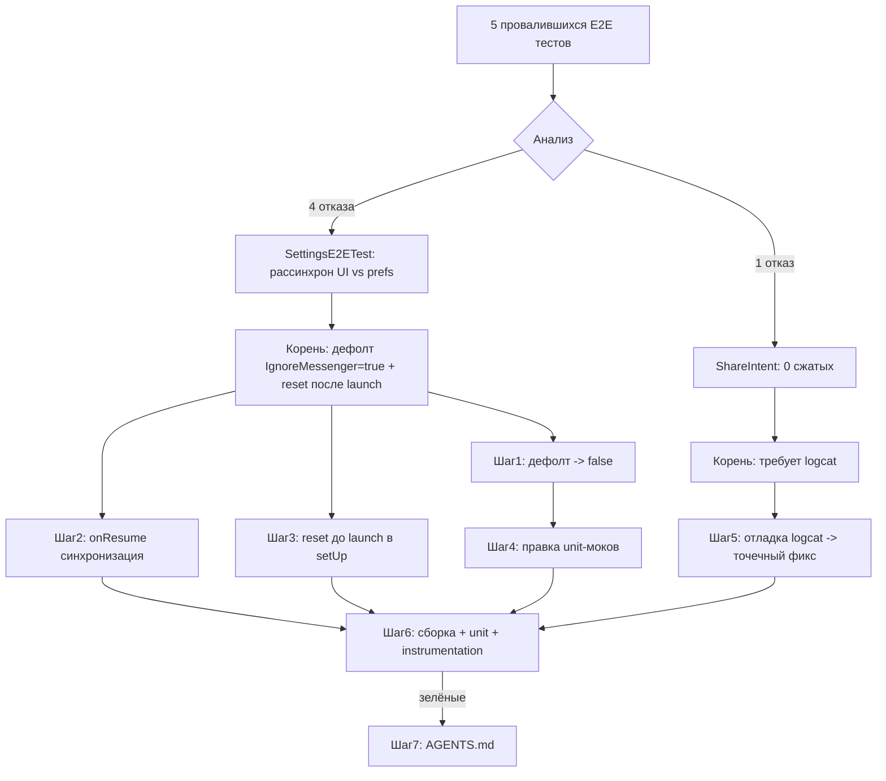

# План: исправление провалившихся instrumentation-тестов (5 отказов)

**Дата:** 2026-06-15
**Статус:** на согласовании
**Связано:** instrumentation-прогон 2026-06-15 → 243 pass / 5 fail

## Контекст провалов

| Тест | Симптом |
|------|---------|
| `SettingsE2ETest.testEnableIgnoreMessengerPhotos` | UI switch не стал `checked` после клика |
| `SettingsE2ETest.testDisableIgnoreMessengerPhotos` | UI switch не стал `unchecked` после клика |
| `SettingsE2ETest.testSettingsPersisted:352` | `assertThat(ignoreMessengerPhotos).isTrue()` — значение осталось `false` |
| `SettingsE2ETest.testAllSettingsTogether:576` | `assertThat(ignoreMessengerPhotos).isTrue()` — значение осталось `false` |
| `ShareIntentE2ETest.testMultipleImagesProcessed` | `compressedUris.size isAtLeast(2)`, но было `0` |

## Корневые причины

### Причина A — SettingsE2ETest (4 отказа)
1. В `SettingsE2ETest.setUp()` порядок нарушен:
   ```kotlin
   mainActivityScenario = ActivityScenario.launch(...)  // (1) Activity читает prefs в onCreate → фиксирует UI
   resetSettings()                                       // (2) меняет prefs напрямую, UI уже не обновляется
   ```
2. Аномалия только у `IgnoreMessengerPhotos`: дефолт `SettingsManager.shouldIgnoreMessengerPhotos()` = **`true`** (стр. 187), тогда как дефолты `isSaveModeReplace()`/`isAutoCompressionEnabled()` = `false`. Тест сбрасывает все к `false`, но при чистом/первом запуске `launch()` видит дефолт `true` → switch инициализируется `checked`, после чего `resetSettings()` меняет prefs, не обновляя UI → рассинхронизация «UI vs prefs».

### Причина B — ShareIntentE2ETest (1 отказ)
Тест создаёт 5 изображений (`E2ETestImageGenerator`), шлёт `ACTION_SEND_MULTIPLE`, polling-ищет сжатые по `DATE_ADDED/DATE_MODIFIED > beforeTimestamp` → `0`. Гипотезы (требуют подтверждения через `adb logcat` в фазе исполнения):
- B1. `ACTION_SEND_MULTIPLE` не запускает автосжатие в `MainActivity` (нет триггера / не обрабатывается множественный intent).
- B2. Тестовые URI классифицируются как «app dir» или «messenger dir» и фильтруются `ImageProcessingChecker` (особенно при `shouldIgnoreMessengerPhotos=true`).
- B3. Режим сохранения (`SAVE_MODE_SEPARATE` по умолчанию после ресета/нового дефолта) создаёт файлы, которые polling не находит по выбранному timestamp/пути.

## Решения (согласовано с пользователем)

- **Решение A1:** Дефолт `IgnoreMessengerPhotos` → `false` (правка приложения).
- **Решение A2:** В `MainActivity.onResume()` — ре-синхронизация состояний switch'ей с prefs (защита от рассинхрона).
- **Решение A3:** В `SettingsE2ETest.setUp()` — сброс prefs **до** `launch()` (детерминированное стартовое состояние).
- **Решение B:** Отладка `ShareIntentE2ETest` через logcat → точечный фикс (код или тест).

## План выполнения (по шагам)

### Шаг 1. SettingsManager — дефолт `IgnoreMessenger` → `false`
- Файл: `app/src/main/java/com/compressphotofast/util/SettingsManager.kt`
- Стр. 187: `getBoolean(Constants.PREF_IGNORE_MESSENGER_PHOTOS, true)` → `false`.
- Обновить KDoc выше метода: «по умолчанию `false`».

### Шаг 2. MainActivity — синхронизация UI с prefs в `onResume`
- Файл: `app/src/main/java/com/compressphotofast/ui/MainActivity.kt`
- Добавить `override fun onResume()` (вызывает `super.onResume()` затем `syncSwitchesFromPrefs()`).
- Добавить приватный `syncSwitchesFromPrefs()`:
  - Временно снимать `setOnCheckedChangeListener(null)` у `switchSaveMode`, `switchAutoCompression` (если есть), `switchIgnoreMessengerPhotos`.
  - Устанавливать `isChecked` из `viewModel.*` геттеров.
  - Возвращать listener'ы.
  - Защита от срабатывания listener'а во время программной установки (поэтому снимаем/возвращаем).
- Цель: UI всегда отражает актуальное состояние prefs после любого возврата на экран.

### Шаг 3. SettingsE2ETest — детерминированный `setUp`
- Файл: `app/src/androidTest/java/com/compressphotofast/e2e/SettingsE2ETest.kt`
- В `setUp()` перенести `resetSettings()` **до** `ActivityScenario.launch(...)`.
- Убедиться, что `settingsManager` инициализируется до `resetSettings()`.
- В `tearDown()` оставить сброс (он уже после `launch`, но для следующего теста старт всё равно будет с чистыми prefs).

### Шаг 4. Unit-тесты SettingsManagerTest — обновить моки под дефолт `false`
- Файл: `app/src/test/java/com/compressphotofast/util/SettingsManagerTest.kt`
- Стр. 624: переименовать `shouldIgnoreMessengerPhotos returns true when not set` → `... returns false when not set`; assertion → `assertFalse`.
- Стр. 626, 638, 650: в `every { mockSharedPreferences.getBoolean(Constants.PREF_IGNORE_MESSENGER_PHOTOS, true) }` заменить дефолт `true` → `false` (иначе MockK не сматчит вызов после Шага 1).
- Тесты `returns true when enabled` (стр. 636) и `returns false when disabled` (стр. 648) по логике остаются, но их `every{}` надо поправить под новый дефолт.
- `setIgnoreMessengerPhotos enables/disables` (стр. 660/674) — не трогать (они мокируют `edit()`, не `getBoolean`).

### Шаг 5. ShareIntentE2ETest — отладка причины `0`
- Запустить единственный тест: `./gradlew connectedDebugAndroidTest -Pandroid.testInstrumentationRunnerArguments class=com.compressphotofast.e2e.ShareIntentE2ETest#testMultipleImagesProcessed` (через `android-test-suite` skill в субагенте) с одновременным `adb logcat -s CompressPhotoFast:* *:E`.
- В логе проверить:
  - (a) Получен ли `ACTION_SEND_MULTIPLE` в `MainActivity` (логи `onCreate`/`handleIntent`).
  - (б) Запущено ли сжатие (логи `ImageCompressionUtil`/`MainViewModel`).
  - (в) Не отфильтрованы ли URI в `ImageProcessingChecker.checkDirectoryStatus` (app dir / messenger dir).
  - (г) В какой режим сохранения пишет компрессия (`SAVE_MODE_SEPARATE`/`REPLACE`) и попадает ли результат в MediaStore-запрос по timestamp.
- По результатам — точечный фикс: либо триггер сжатия в `MainActivity` для `ACTION_SEND_MULTIPLE`, либо корректировка `E2ETestImageGenerator` (путь создания вне app/messenger dir), либо правка polling-запросов в тесте.

### Шаг 6. Проверка (через `android-test-suite` skill в субагенте)
1. `./gradlew assembleDebug` — сборка зелёная.
2. `./scripts/run_unit_tests.sh` — все unit-тесты (ожидаемо: правки в SettingsManagerTest не должны ломать остальные 330).
3. `./scripts/run_instrumentation_tests.sh` — целевые instrumentation-тесты:
   - `SettingsE2ETest` (4 ранее упавших),
   - `ShareIntentE2ETest#testMultipleImagesProcessed`,
   - регрессия: `MainActivityTest`, `SettingsIntegrationTest`, `BatchCompressionE2ETest`, `AutoCompressionE2ETest` (используют тот же switch — убедиться, что дефолт `false` и `onResume` их не ломают).

### Шаг 7. Документация
- Обновить `AGENTS.md` (через `agents-updater` skill): зафиксировать изменение дефолта `IgnoreMessenger` и новый `onResume`-синхронизатор.

## Логика процесса (мермейд)



## Риски и mitigations
- **Риск:** изменение дефолта `IgnoreMessenger` повлияет на `BatchCompressionE2ETest.testMessengerPhotosIgnoredWhenEnabled` / `testMessengerPhotosProcessedWhenDisabled` — они сами выставляют switch, поэтому дефолт не критичен, но проверить в Шаге 6.
- **Риск:** `onResume` синхронизация может затереть состояние, если пользователь только что кликнул switch и listener ещё не отработал — mitigations: снимать/возвращать listener, синхронизировать синхронно в начале `onResume` (после `super`).
- **Риск:** Причина B может оказаться в коде сжатия (не в тесте) — тогда фикс коснётся `MainActivity` (обработка `ACTION_SEND_MULTIPLE`) или `MainViewModel`. Шаг 5 уточнит.

## Acceptance criteria
- [ ] `SettingsE2ETest` — все 4 ранее упавших теста зелёные.
- [ ] `ShareIntentE2ETest.testMultipleImagesProcessed` — зелёный (≥2 обработанных).
- [ ] `./gradlew testDebugUnitTest` — 330+ зелёных (правки моков не ломают others).
- [ ] Регрессия: `MainActivityTest`, `SettingsIntegrationTest`, `BatchCompressionE2ETest`, `AutoCompressionE2ETest` — зелёные.
- [ ] `assembleDebug` — зелёная сборка.
- [ ] `AGENTS.md` обновлён.
