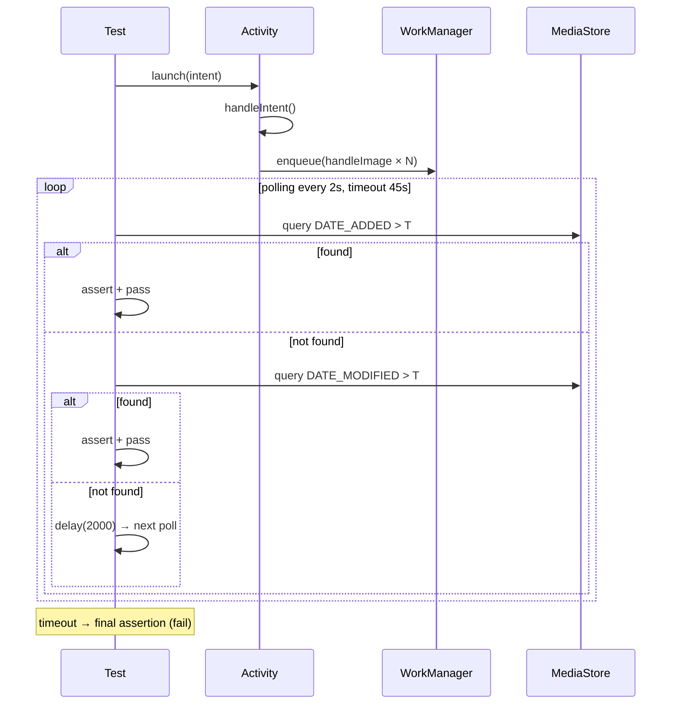

# План: Исправление падающих E2E тестов ShareIntentE2ETest

## Диагноз

Два теста падают:
- `testMultipleImagesProcessed` — `expected to be at least: 2, but was: 0`
- `testCompressionWithDifferentQualities` — `expected not to be: null` (строка 326)

### Корневая причина: тайминг (fixed delay вместо polling)

Оба теста запускают сжатие через WorkManager и ждут результат с помощью **фиксированного `delay()`**:
- `testMultipleImagesProcessed` — `delay(7000)` для 3 изображений
- `testCompressionWithDifferentQualities` — `delay(15000)` для 1 изображения

Но цепочка обработки **асинхронная** и на эмуляторе занимает дольше:

```
Activity launch → onCreate → handleIntent (lifecycleScope) 
  → URI валидация (2× isUriExists + 50ms delay) 
  → ImageProcessingUtil.handleImage() (IO dispatcher)
    → WorkManager.enqueue(APPEND_OR_REPLACE)
      → Worker.doWork() (IO dispatcher)
        → EXIF чтение → testCompression → MediaStore save → верификация
```

Для 3 изображений в последовательной очереди (`APPEND_OR_REPLACE`) на эмуляторе общее время **15–45 сек**, а тест ждёт только 7 сек.

### Вторичная проблема: поиск только по DATE_ADDED

`testMultipleImagesProcessed` использует `findAllCompressedUris()`, который ищет **только по `DATE_ADDED`**. В режиме замены (`isSaveModeReplace = true`) `DATE_ADDED` не обновляется при перезаписи файла — результаты не будут найдены. `testCompressionWithDifferentQualities` имеет fallback на `DATE_MODIFIED`, но `testMultipleImagesProcessed` — нет.

---

## План исправлений

### 1. Добавить polling-методы в `ShareIntentE2ETest`

Заменить фиксированные `delay()` на **polling с таймаутом** — периодический опрос MediaStore до появления результатов.

Добавить 2 вспомогательных метода:

```kotlin
/**
 * Polling-поиск сжатых изображений в MediaStore.
 * Проверяет DATE_ADDED и DATE_MODIFIED с интервалом pollIntervalMs.
 * Возвращает найденные URI или пустой список по таймауту.
 */
private suspend fun waitForCompressedImages(
    afterTimestamp: Long,
    minCount: Int = 1,
    timeoutMs: Long = 45_000L,
    pollIntervalMs: Long = 2_000L
): List<Uri>

/**
 * Polling-поиск одного сжатого изображения.
 * Проверяет DATE_ADDED, затем DATE_MODIFIED.
 */
private suspend fun waitForCompressedImage(
    afterTimestamp: Long,
    timeoutMs: Long = 45_000L,
    pollIntervalMs: Long = 2_000L
): Uri?
```

Оба метода комбинируют поиск по `DATE_ADDED` (новые файлы) и `DATE_MODIFIED` (перезаписанные файлы).

### 2. Добавить `findAllModifiedUris` для множественного поиска по DATE_MODIFIED

Для `testMultipleImagesProcessed` нужен метод, который ищет ВСЕ изменённые файлы после timestamp (аналог `findAllCompressedUris`, но по `DATE_MODIFIED`):

```kotlin
private fun findAllModifiedUris(afterTimestamp: Long): List<Uri>
```

### 3. Обновить `testMultipleImagesProcessed`

**Было:**
```kotlin
delay(7000)
val compressedUris = findAllCompressedUris(beforeTimestamp)
assertThat(compressedUris.size).isAtLeast(2)
```

**Станет:**
```kotlin
val compressedUris = waitForCompressedImages(beforeTimestamp, minCount = 2, timeoutMs = 45_000L)
assertThat(compressedUris.size).isAtLeast(2)
```

Убрать `delay(7000)` и `findAllCompressedUris` — заменить на `waitForCompressedImages`.

### 4. Обновить `testCompressionWithDifferentQualities`

**Было:**
```kotlin
delay(15000)
val compressedUri = findLatestCompressedUri(beforeTimestamp)
if (compressedUri == null) {
    val compressedUriByMod = findLatestCompressedUriByModifiedDate(beforeTimestamp)
    assertThat(compressedUriByMod).isNotNull()
}
```

**Станет:**
```kotlin
val compressedUri = waitForCompressedImage(beforeTimestamp, timeoutMs = 45_000L)
assertThat(compressedUri).isNotNull()
```

Убрать `delay(15000)` и ручной fallback на `DATE_MODIFIED` — polling-метод уже это делает.

### 5. Исправить очистку предпочтений в `BaseE2ETest`

`BaseE2ETest.cleanupTestData()` очищает файл `"com.compressphotofast_preferences"`, но `SettingsManager` использует `"compress_photo_prefs"` (из `Constants.PREF_FILE_NAME`). Это разные файлы — настройки НЕ очищаются.

**Исправление:** заменить захардкоженное имя на `Constants.PREF_FILE_NAME`:

```kotlin
val prefsName = Constants.PREF_FILE_NAME  // "compress_photo_prefs"
```

---

## Логика процесса (Mermaid)



---

## Файлы для изменения

| Файл | Изменение |
|------|-----------|
| `app/src/androidTest/.../e2e/ShareIntentE2ETest.kt` | Добавить polling-методы, обновить 2 теста |
| `app/src/androidTest/.../BaseE2ETest.kt` | Исправить имя prefs-файла в `cleanupTestData()` |

## Риски

- **Таймаут 45 сек** может увеличить время выполнения тестов, если сжатие не происходит. Но это лучше, чем флакующие тесты.
- Polling добавляет небольшой overhead (запросы к MediaStore каждые 2 сек), но в контексте E2E это пренебрежимо.
