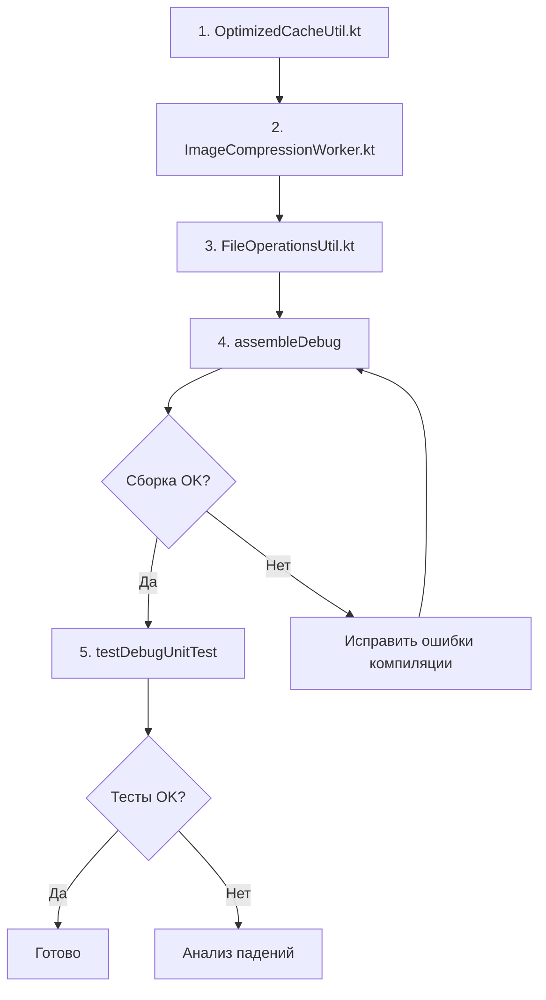

# План: Исправления по результатам ревью

**Дата**: 2026-06-08  
**Статус**: Готов к реализации

---

## Изменения (3 файла)

### 1. OptimizedCacheUtil.kt — Переписать `getCachedExifData()`

**Проблема**: Агент оставил gap между read lock и write lock. Другой поток может прочитать stale данные в этом окне. Также изменено поведение при `currentModificationTime == 0L` (раньше expired записи удалялись только при `> 0L`).

**Решение**: Убрать removal из функции полностью. Вернуть только read lock. Stale данные не возвращаем (return null), но и не удаляем — это делает `cleanupExpiredEntries()`.

**Было** (agent's version):
```kotlin
fun getCachedExifData(uri: Uri, currentModificationTime: Long): CachedExifData? {
    val cacheKey = uri.toString()
    var needsRemoval = false

    exifCacheLock.read {
        val cached = exifCache.get(cacheKey)
        if (cached != null) {
            if (cached.isExpired() || (currentModificationTime > 0L && cached.isStaleFor(currentModificationTime))) {
                needsRemoval = true
            } else {
                return cached
            }
        }
    }

    if (needsRemoval) {
        exifCacheLock.write {
            val cached = exifCache.get(cacheKey)
            if (cached != null && (cached.isExpired() || (currentModificationTime > 0L && cached.isStaleFor(currentModificationTime)))) {
                exifCache.remove(cacheKey)
            }
        }
    }
    return null
}
```

**Станет**:
```kotlin
fun getCachedExifData(uri: Uri, currentModificationTime: Long): CachedExifData? {
    val cacheKey = uri.toString()

    exifCacheLock.read {
        val cached = exifCache.get(cacheKey)
        if (cached != null) {
            if (cached.isExpired() || (currentModificationTime > 0L && cached.isStaleFor(currentModificationTime))) {
                // Stale — не возвращаем, но и не удаляем (cleanupExpiredEntries() почистит)
                return@read null
            }
            return cached
        }
    }

    return null
}
```

**Почему это правильно**:
- Нет write lock → нет gap → нет race condition
- Stale данные не возвращаются → вызывающая сторона пересчитает
- `cleanupExpiredEntries()` регулярно чистит expired записи (вызывается из `TempFilesCleaner` и других мест)
- При пересчёте `cacheExifData()` или `getOrComputeExifData()` перезапишут stale entry

---

### 2. ImageCompressionWorker.kt — Упростить логику `isHandledByIpu`

**Проблема**: Код запутан — вызывается `addProcessingUriSafe()` но результат игнорируется (`true` всегда).

**Было** (строки 99-107):
```kotlin
val isHandledByIpu = inputData.getBoolean("is_handled_by_ipu", false)
val addedToProcessing = if (isHandledByIpu) {
    // Передача владения от ImageProcessingUtil
    // Гарантируем, что URI действительно есть в трекере, иначе добавляем
    uriProcessingTracker.addProcessingUriSafe(imageUri, "ImageCompressionWorker_Takeover")
    true
} else {
    uriProcessingTracker.addProcessingUriSafe(imageUri, "ImageCompressionWorker")
}
```

**Станет**:
```kotlin
val isHandledByIpu = inputData.getBoolean("is_handled_by_ipu", false)
val addedToProcessing = if (isHandledByIpu) {
    // IPU добавил URI в трекер и не снял — Worker наследует владение.
    // addProcessingUriSafe — перестраховка: если cleanup уже удалил URI, добавим заново.
    // Результат игнорируем: IPU гарантирует эксклюзивность через per-URI WorkManager tag
    uriProcessingTracker.addProcessingUriSafe(imageUri, "ImageCompressionWorker_Takeover")
    true
} else {
    uriProcessingTracker.addProcessingUriSafe(imageUri, "ImageCompressionWorker")
}
```

**Что меняется**: Только комментарий. Логика идентична — она была правильной, но непонятной. Теперь объяснена.

---

### 3. FileOperationsUtil.kt — Исправить RC-5 (TOCTOU в deleteFile)

**Проблема**: Двойная проверка `isUriExistsSuspend` перед `delete()` — бессмысленна (TOCTOU gap между ними всё равно остаётся) и добавляет задержку (2 ContentResolver запроса вместо 1).

**Было** (строки 122-141):
```kotlin
// Двойная проверка существования файла перед удалением
if (!UriUtil.isUriExistsSuspend(context, uri)) {
    LogUtil.processWarning("deleteFile: URI не существует (первая проверка), удаление отменено: $uri")
    return false
}

// Повторная проверка существования файла без задержки
// Используем getLastModifiedTime для обнаружения изменений
val lastModifiedBefore = System.currentTimeMillis()
if (!UriUtil.isUriExistsSuspend(context, uri)) {
    LogUtil.processWarning("deleteFile: URI не существует (вторая проверка), удаление отменено: $uri")
    return false
}
val lastModifiedAfter = System.currentTimeMillis()

// Логируем предупреждение если файл был изменён во время операции
if (lastModifiedAfter - lastModifiedBefore > 100) {
    LogUtil.processWarning("deleteFile: Файл был изменён во время проверки: $uri")
}
```

**Станет**:
```kotlin
// Проверка существования файла перед удалением
if (!UriUtil.isUriExistsSuspend(context, uri)) {
    LogUtil.processWarning("deleteFile: URI не существует, удаление отменено: $uri")
    return false
}
```

**Почему это правильно**:
- Одна проверка достаточна для оптимизации (не вызывать delete если файла уже нет)
- TOCTOU между check и delete неизбежен, но `contentResolver.delete()` безопасен — возвращает 0 если файл исчез
- Двойная проверка не добавляет безопасности, только задержку (2 ContentResolver запроса)

---

## Порядок выполнения



## Верификация

1. `./gradlew assembleDebug` — сборка (~2 мин)
2. `./gradlew testDebugUnitTest` — unit тесты (~10 мин)
