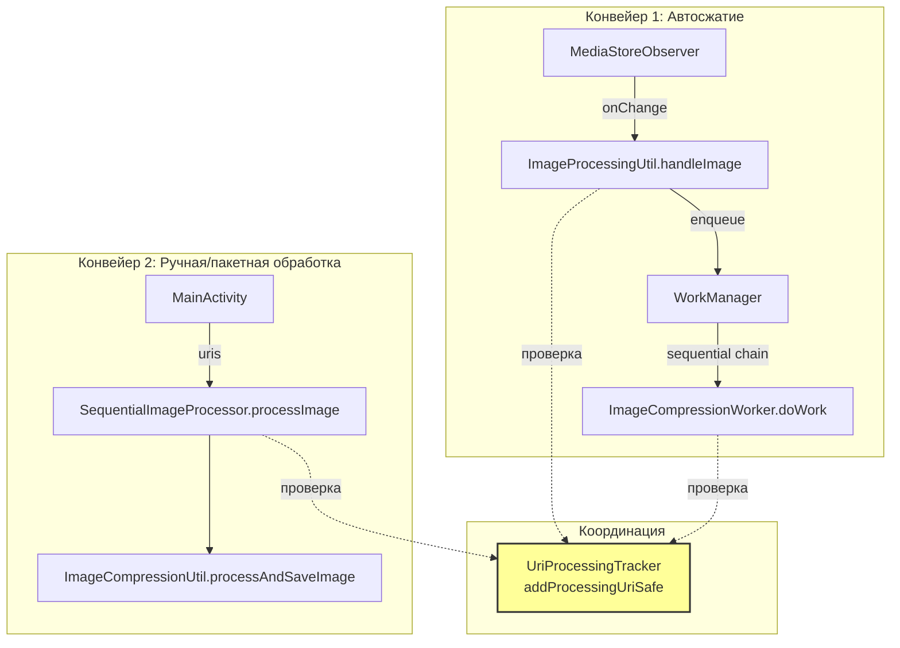

# Анализ гонок состояний (Race Conditions) в процессе сжатия

**Дата**: 2026-06-08  
**Версия**: 2.2.10  
**Логи**: LOG.txt (23:56:50 — 23:56:53, ~30 изображений в параллельной обработке)  
**Аналитики**: 2 независимых агента

---

## Архитектура параллельной обработки

Существует **два параллельных конвейера**, которые могут обрабатывать один и тот же URI:



**Ключевой механизм защиты**: `UriProcessingTracker.addProcessingUriSafe()` — per-URI Mutex, возвращает `false` если URI уже обрабатывается.

---

## Найденные гонки состояний

### 🔴 RC-1: CRITICAL — Преждевременное снятие URI с отслеживания в ImageProcessingUtil

**Файл**: `ImageProcessingUtil.kt:115`  
**Аналитик**: #1

```
addProcessingUriSafe(uri)          // ← URI под защитой
  → WorkManager.enqueue(...)       // ← Worker поставлен в очередь
removeProcessingUriSafe(uri)       // ← 🐛 СНЯТИЕ ДО запуска Worker!
  ...
Worker.doWork()                    // ← Worker стартует позже
  addProcessingUriSafe(uri)        // ← URI снова под защитой
```

**Проблема**: Между `removeProcessingUriSafe()` (строка 115) и моментом, когда Worker вызывает `addProcessingUriSafe()`, URI **никем не отслеживается**.

**Подтверждение из логов**:
```
23:56:50.845 URI добавлен (safe): ...282896 из ImageProcessingUtil
23:56:50.897 СЖАТИЕ:2896] Запущена работа по сжатию
23:56:50.898 URI удалён (safe): ...282896              ← Снятие ДО Worker!
                    ... (Worker ещё не запустился)
23:56:51.001 Worker.doWork() НАЧАЛО: ...282905         ← Другой Worker для другого URI
```

**Риск**: MediaStoreObserver или повторный вызов `handleImage()` для того же URI в этом окне (50-200ms) приведёт к **дублированию обработки**.

**Частота**: При burst-режиме (30+ фото за секунду) вероятность высока.

**Вариант исправления**: См. раздел «План исправлений» ниже.

---

### 🔴 RC-2: CRITICAL — Worker читает EXIF ДО захвата блокировки обработки

**Файл**: `ImageCompressionWorker.kt:143-178`  
**Аналитик**: #1

```kotlin
// Шаг 1: Чтение EXIF (БЕЗ блокировки)
val exifDataMemory = ExifUtil.readExifDataToMemory(appContext, imageUri)   // line 143

// Шаг 2: Проверка необходимости (БЕЗ блокировки)  
val processingCheckResult = ImageProcessingChecker.isProcessingRequired(...) // line 159

// Шаг 3: Захват блокировки (ТОЛЬКО ЗДЕСЬ)
val addedToProcessing = uriProcessingTracker.addProcessingUriSafe(...)     // line 178
```

**Подтверждение из логов**:
```
23:56:51.004 Worker.doWork() НАЧАЛО: ...282905
23:56:51.004 URI из кэша: ...282905 -> true          ← Чтение EXIF
23:56:51.015 Чтение EXIF данных из кэша для ...282905 ← Чтение EXIF
23:56:51.078 URI уже обрабатывается: ...282905        ← Блокировка (запаздывает на 74ms!)
```

**Риск**: Между шагом 1 и шагом 3 (~74ms в логах) другой поток может модифицировать файл. Worker прочитает **частично изменённые** EXIF данные.

**Вариант исправления**: Перенести `addProcessingUriSafe()` ДО чтения EXIF.

---

### 🔴 RC-3: CRITICAL — Гонка имён файлов в MediaStoreUtil при сохранении в отдельную папку

**Файл**: `MediaStoreUtil.kt:560-566`  
**Аналитик**: #2

```kotlin
val saveLock = getSaveLock(originalUri)  // ← Блокировка по ИСХОДНОМУ URI
saveLock.withLock {
    saveCompressedImageFromStreamInternal(...)
}
```

**Проблема**: Блокировка по `originalUri` защищает от параллельного сжатия **одного и того же** файла. Но если два **разных** исходных файла (например, `/Camera/IMG_01.jpg` и `/Viber/IMG_01.jpg`) обрабатываются одновременно и должны быть сохранены с одинаковым сжатым именем (`IMG_01_compressed.jpg`):

1. **Поток А** получает Mutex для `/Camera/IMG_01.jpg`
2. **Поток Б** получает Mutex для `/Viber/IMG_01.jpg` (ДРУГОЙ Mutex!)
3. Оба одновременно входят в `createMediaStoreEntryV2()` → `handleFileNameConflict()`
4. Оба проверяют наличие `IMG_01_compressed.jpg` → **не найдено**
5. Оба вызывают `contentResolver.insert(...)` с одинаковым именем

**Следствие**: `SQLiteConstraintException` или тихое создание дубликата с суффиксом `(1)`, о котором приложение не знает.

**Вариант исправления**: Дополнить блокировку по `originalUri` блокировкой по целевому пути: `getSaveLock(directory + "/" + fileName)`.

---

### 🟡 RC-4: MODERATE — SequentialImageProcessor не устанавливает ignore period

**Файл**: `SequentialImageProcessor.kt:389-391`  
**Аналитик**: #1

```kotlin
} finally {
    uriProcessingTracker.removeProcessingUriSafe(uri)
    // 🐛 НЕТ setIgnorePeriod()
    // 🐛 НЕТ addRecentlyProcessedUri()
}
```

Сравните с Worker (`ImageCompressionWorker.kt:331-334, 490-493`):
```kotlin
uriProcessingTracker.setIgnorePeriod(savedUri)           // ✅ 60 секунд
uriProcessingTracker.addRecentlyProcessedUri(globalImageUri) // ✅ 
```

**Риск**: После обработки через SequentialImageProcessor URI **не защищён** от повторной обработки.

**Смягчение**: EXIF-маркер предотвращает повторное сжатие, но лишняя проверка создаёт ненужную нагрузку.

---

### 🟡 RC-5: MODERATE — TOCTOU в FileOperationsUtil.deleteFile

**Файл**: `FileOperationsUtil.kt:122-140`  
**Аналитик**: #2

```kotlin
// Двойная проверка существования файла перед удалением
if (!UriUtil.isUriExistsSuspend(context, uri)) { return false }
val lastModifiedBefore = System.currentTimeMillis()
if (!UriUtil.isUriExistsSuspend(context, uri)) { return false }
val lastModifiedAfter = System.currentTimeMillis()
// ... затем:
val result = context.contentResolver.delete(cleanUri, null, null) > 0
```

**Проблема**: Между `isUriExistsSuspend()` и `contentResolver.delete()` другой процесс может удалить или изменить файл. Двойная проверка бессмысленна и создаёт ложное чувство безопасности. `MediaStore.delete()` атомарен и возвращает количество удалённых строк.

**Вариант исправления**: Убрать двойные проверки, оставить только `try-catch` вокруг `delete()`.

---

### 🟡 RC-6: MODERATE — CompressionBatchTracker.getOrCreateAutoBatch() не синхронизирован

**Файл**: `CompressionBatchTracker.kt:210-237`  
**Аналитик**: #1 (найдено), #2 (подтверждено безопасно для текущих данных)

```kotlin
fun getOrCreateAutoBatch(): String {
    val activeBatch = batches.values.find { ... }  // ← ЧТЕНИЕ
    if (activeBatch != null) return activeBatch.batchId
    batches[batchId] = batch                       // ← ЗАПИСЬ
    scheduleTimeout(batchId, ...)
}
```

**Риск**: Два потока создадут два разных автобатча → пользователь увидит **два уведомления** вместо одного.

---

### 🟢 RC-7: LOW — ExifUtil TtlLruCache неатомарный check-then-remove

**Файл**: `ExifUtil.kt:67-74`  
**Аналитик**: #1

Между `isExpired()` и `remove()` другой поток может получить устаревшие данные. Последствие: лишнее чтение EXIF с диска.

---

### 🟢 RC-8: LOW — OptimizedCacheUtil разрыв read→write lock

**Файл**: `OptimizedCacheUtil.kt:242-275`  
**Аналитик**: #1

Та же проблема что RC-7 — между release read lock и acquire write lock другой поток может прочитать stale кэш.

---

### 🟢 RC-9: LOW (защищено) — MediaStoreObserver срабатывает во время сжатия

**Аналитик**: #1

Защита в 3 эшелона: 10-секундная задержка + ignore period 60 сек + EXIF-маркер.

---

### ✅ Подтверждено безопасным

| Компонент | Почему безопасно |
|-----------|-----------------|
| `UriProcessingTracker.addProcessingUriSafe` | Per-URI Mutex корректно отклоняет дубликаты |
| `FileOperationsUtil.createTempImageFile` | `File.createTempFile()` атомарен в Linux |
| `CompressionBatchTracker.addResult` | `synchronized(batch)` защищает results и timeoutJob |
| `MediaStoreUtil.saveCompressedImageFromStream` | Mutex по originalUri защищает от записи в один файл |

---

## Сводная таблица

| ID | Серьёзность | Файл | Проблема | Кто нашёл |
|----|------------|------|----------|-----------|
| RC-1 | 🔴 CRITICAL | ImageProcessingUtil:115 | URI не отслеживается между remove и Worker start | #1 |
| RC-2 | 🔴 CRITICAL | ImageCompressionWorker:143 | EXIF читается до захвата блокировки | #1 |
| RC-3 | 🔴 CRITICAL | MediaStoreUtil:560 | Блокировка по originalUri, а не по целевому пути | #2 |
| RC-4 | 🟡 MODERATE | SequentialImageProcessor:389 | Нет ignore period после обработки | #1 |
| RC-5 | 🟡 MODERATE | FileOperationsUtil:122 | TOCTOU двойная проверка перед delete | #2 |
| RC-6 | 🟡 MODERATE | CompressionBatchTracker:210 | Неатомарный find+create автобатча | #1 |
| RC-7 | 🟢 LOW | ExifUtil:67 | TtlLruCache неатомарный check-remove | #1 |
| RC-8 | 🟢 LOW | OptimizedCacheUtil:242 | Разрыв read→write lock | #1 |
| RC-9 | 🟢 LOW | MediaStoreObserver | Срабатывание во время сжатия (защищено) | #1 |

---

## План исправлений

### Шаг 1: RC-2 — Ранний захват блокировки в Worker

**Файл**: `ImageCompressionWorker.kt`  
**Сложность**: Низкая  
**Риск регрессии**: Низкий

Перенести `addProcessingUriSafe()` в самое начало `doWork()`, ДО чтения EXIF:

```kotlin
override suspend fun doWork(): Result = withContext(Dispatchers.IO) {
    val uriString = inputData.getString(Constants.WORK_INPUT_IMAGE_URI)
    if (uriString.isNullOrEmpty()) return@withContext Result.failure()
    val imageUri = Uri.parse(uriString)
    
    // 🔄 РАННИЙ ЗАХВАТ (до любой работы с файлом!)
    val addedToProcessing = uriProcessingTracker.addProcessingUriSafe(imageUri, "ImageCompressionWorker")
    if (!addedToProcessing) {
        LogUtil.processDebug("URI уже обрабатывается, пропускаем Worker: $imageUri")
        return@withContext Result.success()
    }
    
    try {
        // Проверка существования
        // Чтение EXIF (теперь под защитой)
        // Сжатие
        // ...
    } finally {
        uriProcessingTracker.removeProcessingUriSafe(imageUri)
        uriProcessingTracker.addRecentlyProcessedUri(imageUri)
    }
}
```

---

### Шаг 2: RC-4 — Добавить ignore period в SequentialImageProcessor

**Файл**: `SequentialImageProcessor.kt`  
**Сложность**: Низкая  
**Риск регрессии**: Низкий

В `finally` блоке `processImage()` (строка 389):
```kotlin
} finally {
    uriProcessingTracker.removeProcessingUriSafe(uri)
    uriProcessingTracker.addRecentlyProcessedUri(uri)   // ← ДОБАВИТЬ
    uriProcessingTracker.setIgnorePeriod(uri)            // ← ДОБАВИТЬ (60 сек)
}
```

---

### Шаг 3: RC-5 — Убрать TOCTOU в FileOperationsUtil.deleteFile

**Файл**: `FileOperationsUtil.kt`  
**Сложность**: Низкая  
**Риск регрессии**: Низкий

Заменить двойную проверку на прямой `try-catch`:

```kotlin
suspend fun deleteFile(...): Any? {
    if (!forceDelete && uriProcessingTracker.isProcessing(uri)) {
        return false
    }
    try {
        val cleanUri = ... // обработка #renamed_original
        
        if (Build.VERSION.SDK_INT >= Build.VERSION_CODES.Q) {
            try {
                val result = context.contentResolver.delete(cleanUri, null, null) > 0
                if (result) UriUtil.invalidateUriExistsCache(cleanUri)
                return result
            } catch (e: SecurityException) {
                if (e is RecoverableSecurityException) {
                    return e.userAction.actionIntent.intentSender
                }
                throw e
            }
        } else {
            // Старый API...
        }
    } catch (e: Exception) { ... }
}
```

---

### Шаг 4: RC-3 — Двойная блокировка в MediaStoreUtil

**Файл**: `MediaStoreUtil.kt`  
**Сложность**: Средняя  
**Риск регрессии**: Средний

Дополнить блокировку по `originalUri` блокировкой по целевому пути:

```kotlin
suspend fun saveCompressedImageFromStream(
    context: Context,
    inputStream: InputStream,
    fileName: String,
    directory: String,
    originalUri: Uri,
    quality: Int,
    exifDataMemory: Map<String, Any>?,
    mimeType: String
): Uri? = withContext(Dispatchers.IO) {
    // Блокировка 1: по исходному URI (защита от параллельного сжатия одного файла)
    val sourceLock = getSaveLock(originalUri)
    sourceLock.withLock {
        // Блокировка 2: по целевому пути (защита от конфликта имён)
        val targetLock = getSaveLock(Uri.parse("target://$directory/$fileName"))
        targetLock.withLock {
            saveCompressedImageFromStreamInternal(
                context, inputStream, fileName, directory, originalUri, quality, exifDataMemory, mimeType
            )
        }
    }
}
```

---

### Шаг 5: RC-1 — Переработать логику отслеживания в ImageProcessingUtil

**Файл**: `ImageProcessingUtil.kt`  
**Сложность**: Высокая  
**Риск регрессии**: Высокий  
**Зависимость**: Должен быть выполнен ПОСЛЕ шага 1

**Рекомендуемый подход** (Вариант C — минимальные изменения):

Оставить текущую логику `removeProcessingUriSafe()` в `handleImage()`, но полагаться на:
1. **Шаг 1** (RC-2): Worker захватывает блокировку в самом начале `doWork()` 
2. **Per-URI tag дедупликация**: `compress_${uri.hashCode()}` предотвращает дублирование в WorkManager
3. **EXIF-маркер**: Последний эшелон защиты

Это минимальное изменение, которое уже устраняет основное окно уязвимости. Worker с ранним захватом (шаг 1) защитит файл в критическом окне.

**Альтернатива** (более полная, но рискованная):

Не снимать URI в `handleImage()`, а передать флаг владения через `inputData`:

```kotlin
// ImageProcessingUtil:
inputData["tracking_owner"] = "ImageProcessingUtil"

// Worker:
val owner = inputData.getString("tracking_owner")
if (owner != null) {
    // URI уже отслеживается IPU — мы законные наследники
    // Не вызываем addProcessingUriSafe, а просто "перенимаем" владение
} else {
    val added = addProcessingUriSafe(...)
    if (!added) skip
}
```

---

### Шаг 6: RC-6 — Синхронизировать getOrCreateAutoBatch

**Файл**: `CompressionBatchTracker.kt`  
**Сложность**: Низкая  
**Риск регрессии**: Низкий

```kotlin
fun getOrCreateAutoBatch(): String {
    synchronized(batches) {
        val activeBatch = batches.values.find {
            !it.isIntentBatch &&
            (System.currentTimeMillis() - it.createdAt) < AUTO_BATCH_MAX_LIFETIME_MS
        }
        if (activeBatch != null) return activeBatch.batchId

        val batchId = "auto_batch_${batchIdCounter.getAndIncrement()}_${System.currentTimeMillis()}"
        batches[batchId] = CompressionBatch(batchId = batchId, expectedCount = null, isIntentBatch = false)
        scheduleTimeout(batchId, AUTO_BATCH_IDLE_TIMEOUT_MS)
        cleanupOldBatches()
        return batchId
    }
}
```

---

## Рекомендуемый порядок выполнения

```mermaid
gantt
    title План исправлений race conditions
    dateFormat X
    axisFormat %s
    
    section Простые исправления
    RC-2 Worker ранний захват        :done, rc2, 0, 1
    RC-4 SIP ignore period          :done, rc4, 1, 2
    RC-5 Убрать TOCTOU delete       :rc5, 2, 3
    RC-6 Синхронизировать batch     :rc6, 3, 4
    
    section Средние исправления
    RC-3 Двойная блокировка save    :rc3, 4, 6
    
    section Сложные исправления
    RC-1 IPU логика отслеживания    :rc1, 6, 9
    
    section Тестирование
    Unit тесты                      :test, 9, 10
    Burst-режим 30+ фото           :burst, 10, 11
```



| Приоритет | ID | Изменение | Файлы | Сложность |
|-----------|-----|-----------|-------|-----------|
| 1 | RC-2 | Ранний захват в Worker | ImageCompressionWorker.kt | Низкая |
| 2 | RC-4 | ignore period в SIP | SequentialImageProcessor.kt | Низкая |
| 3 | RC-5 | Убрать TOCTOU delete | FileOperationsUtil.kt | Низкая |
| 4 | RC-6 | Синхронизировать batch | CompressionBatchTracker.kt | Низкая |
| 5 | RC-3 | Двойная блокировка save | MediaStoreUtil.kt | Средняя |
| 6 | RC-1 | Логика отслеживания IPU | ImageProcessingUtil.kt + Worker | Высокая |
| 7 | — | Тестирование burst 30+ | — | — |

---

## Перекрёстная проверка аналитиков

| Нахождение | Аналитик #1 | Аналитик #2 | Консенсус |
|-----------|:-----------:|:-----------:|:---------:|
| RC-1 IPU преждевременное снятие | 🔴 Найдено | — | ✅ Согласовано |
| RC-2 Worker читает EXIF до блокировки | 🔴 Найдено | — | ✅ Согласовано |
| RC-3 MediaStoreUtil гонка имён файлов | Упомянуто как LOW | 🔴 Найдено как CRITICAL | ⬆️ Повышено до CRITICAL |
| RC-4 SIP нет ignore period | 🟡 Найдено | — | ✅ Согласовано |
| RC-5 TOCTOU в deleteFile | — | 🟡 Найдено | ✅ Согласовано |
| RC-6 Batch tracker не синхронизирован | 🟡 Найдено | ✅ Безопасно для текущих данных | 🟡 Оставлен MODERATE |
| UriProcessingTracker защита | ✅ Безопасно | ✅ Безопасно | ✅ Безопасно |
| Временные файлы | — | ✅ Безопасно | ✅ Безопасно |
| CompressionBatchTracker.addResult | ✅ Безопасно | ✅ Безопасно | ✅ Безопасно |

---

## Примечания

- Логи показывают, что **текущая защита работает** для большинства случаев — Worker корректно пропускает URI, которые обрабатывает SequentialImageProcessor
- Гонки RC-1, RC-2, RC-3 проявляются при **высокой нагрузке** (burst-режим, 30+ фото/сек)
- EXIF-маркер `CompressPhotoFast_Compressed` является **последним эшелоном защиты** — предотвращает повторное сжатие даже при прорыве всех остальных защит
- 4 из 6 исправлений — **низкой сложности**, могут быть выполнены быстро
