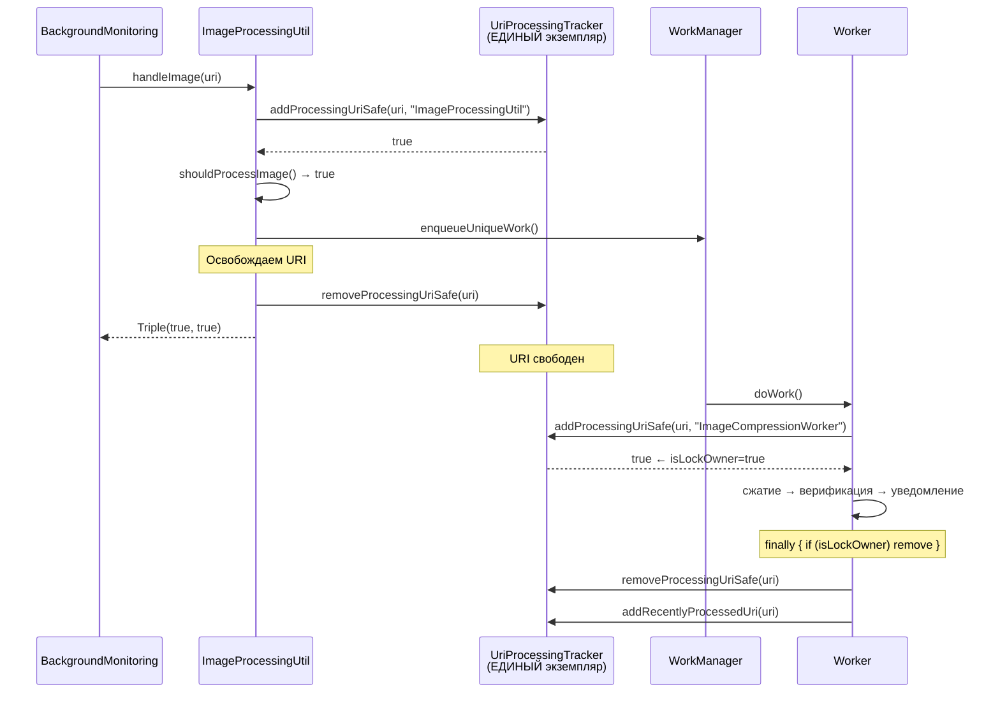

# Комбинированный план: Исправление гонок состояний

**Дата:** 2026-06-07  
**Анализ:** Аудит LOG.txt + исходный код (2 независимых агента)

---

## Корневая причина: Дублирующийся синглтон UriProcessingTracker

`CompressionBatchTracker` корректно синхронизирует Hilt-экземпляр со статическим через `init { staticInstance = this }`.  
**UriProcessingTracker этого НЕ делает** — `fallbackInstance` и Hilt-экземпляр — **два разных объекта в памяти**.

```
ImageProcessingUtil (object)  → getInstance() → fallbackInstance (Map A)
ImageCompressionWorker (Hilt) → @Inject        → Hilt instance   (Map B)
BackgroundMonitoringService   → @Inject        → Hilt instance   (Map B)
```

**Следствие:** handleImage() добавляет URI в Map A, Worker проверяет Map B — не видит блокировки, может обработать повторно. Но Map A засоряется: URI добавлены, но никто не удаляет → через время все URI «уже обрабатываются» в Map A.

**Доказательство в LOG.txt:** строки 1-115 — массовое «URI уже обрабатывается» для URIs 282828-282808 в Map A, хотя Worker работает с Map B.

---

## Все найденные проблемы (8 штук, приоритизированы)

| ID | Критичность | Проблема | Кто нашёл |
|----|-------------|----------|-----------|
| RC-0 | 🟣 КРИТ | Дублирующийся синглтон UriProcessingTracker | Другой агент |
| RC-1 | 🟣 КРИТ | handleImage() не освобождает URI после enqueue | Мой анализ |
| RC-2 | 🟣 КРИТ | Worker: утечки блокировок при early return | Другой агент |
| RC-3 | 🔴 ВЫС | CompressionBatchTracker.results — MutableList без синхронизации | Мой анализ |
| RC-4 | 🔴 ВЫС | CompressionBatchTracker.scheduleTimeout — неатомарная замена | Мой анализ |
| RC-5 | 🟡 СРЕД | Concurrent URI discovery: GalleryScan + MediaStoreObserver | Оба |
| RC-6 | 🟡 СРЕД | Double EXIF check-and-cache | Мой анализ |
| RC-7 | 🟢 НИЗ | Minor races (@Volatile, TTL, compute()) | Мой анализ |

---

## План исправлений (6 шагов)

### Шаг 1 — RC-0: Унификация синглтона UriProcessingTracker

**Проблема:** Hilt создаёт один экземпляр, `getInstance()` — другой. Два независимых `processingUris` map.

**Решение (подход другого агента — более надёжный):**

1. Добавить в `UriProcessingTracker.kt` `init`-блок, как в `CompressionBatchTracker`:
```kotlin
init {
    fallbackInstance = this
}
```

2. Добавить в `AppModule.kt` провайдер, делегирующий к `getInstance()`:
```kotlin
@Provides
@Singleton
fun provideUriProcessingTracker(@ApplicationContext context: Context): UriProcessingTracker {
    return UriProcessingTracker.getInstance(context)
}
```

3. Удалить `@Singleton` и `@Inject constructor` из `UriProcessingTracker`, сделать конструктор приватным.

**Результат:** Все пути (Hilt и статический) работают с одним экземпляром.

**Файлы:**
- `UriProcessingTracker.kt` — init sync + private constructor
- `AppModule.kt` — добавить @Provides

---

### Шаг 2 — RC-1 + RC-2: Жизненный цикл блокировки (handleImage → Worker)

**Проблема:** После унификации синглтона, handleImage() добавит URI в ЕДИНЫЙ map. Worker вызовет `addProcessingUriSafe()` → получит `false` → **пропустит сжатие**. Плюс утечки блокировок в Worker при early return.

**Решение (комбинированное):**

**2a. ImageProcessingUtil.kt** — освободить URI после enqueue:
```kotlin
// После строки enqueueUniqueWork() (111)
UriProcessingTracker.getInstance(context).removeProcessingUriSafe(uri)
return@withContext Triple(true, true, "Сжатие запущено")
```

**2b. ImageCompressionWorker.kt** — флаг `isLockOwner` + единый `finally`:
```kotlin
var isLockOwner = false
try {
    // ... early checks (существование, EXIF) ...
    
    val addedToProcessing = uriProcessingTracker.addProcessingUriSafe(imageUri, "ImageCompressionWorker")
    isLockOwner = addedToProcessing  // ← запоминаем владельца
    if (!addedToProcessing) {
        return@withContext Result.success()
    }
    
    // ... основная логика сжатия ...
    
    // Удалить блок addProcessingUriSafe/removeProcessingUriSafe внутри delete-блока
    // (строки 354, 371) — это приводило к преждевременному освобождению
    
} catch (e: Exception) {
    // ... обработка ошибок ...
} finally {
    if (isLockOwner) {
        uriProcessingTracker.removeProcessingUriSafe(uri)
        uriProcessingTracker.addRecentlyProcessedUri(uri)
    }
    testResult?.compressedStream?.close()
}
```

**Ключевые изменения в Worker:**
- Убрать `addProcessingUriSafe("delete_operation")` в блоке удаления (строка 354) — URI уже в обработке
- Убрать `removeProcessingUriSafe` в finally-блоке удаления (строка 371) — преждевременное освобождение
- Убрать `removeProcessingUriSafe` в не-delete ветке (строка 375)
- Убрать `removeProcessingUriSafe` в skip-ветке (строка 477)
- Все эти вызовы заменяются единым `finally { if (isLockOwner) remove }`

**Файлы:**
- `ImageProcessingUtil.kt` — removeProcessingUriSafe после enqueue
- `ImageCompressionWorker.kt` — isLockOwner + единый finally

---

### Шаг 3 — RC-5: Координация сканирования при старте

**Проблема:** `scanHistoryImages()` и `scanRecentImages()` запускаются одновременно при старте сервиса и конкурируют за одни URI.

**Решение (подход другого агента):**

В `BackgroundMonitoringService.kt` добавить `Mutex`:
```kotlin
private val scanMutex = kotlinx.coroutines.sync.Mutex()

private suspend fun scanForNewImages() {
    if (!scanMutex.tryLock()) {
        LogUtil.processDebug("Сканирование уже выполняется, пропуск")
        return
    }
    try {
        // ... существующая логика ...
    } finally {
        scanMutex.unlock()
    }
}

private suspend fun scanGalleryForUnprocessedImages() {
    if (!scanMutex.tryLock()) {
        LogUtil.processDebug("Сканирование уже выполняется, пропуск")
        return
    }
    try {
        // ... существующая логика ...
    } finally {
        scanMutex.unlock()
    }
}
```

**Файлы:**
- `BackgroundMonitoringService.kt`

---

### Шаг 4 — RC-3 + RC-4: CompressionBatchTracker

**RC-3: MutableList без синхронизации:**
```kotlin
// Было:
var results: MutableList<CompressionResult> = mutableListOf()
// Стало:
var results: MutableList<CompressionResult> = Collections.synchronizedList(mutableListOf())
```

**RC-4: scheduleTimeout неатомарный:**
```kotlin
private fun scheduleTimeout(batchId: String, timeoutMs: Long) {
    val batch = batches[batchId] ?: return
    synchronized(batch) {
        batch.timeoutJob?.cancel()
        batch.timeoutJob = mainScope.launch {
            delay(timeoutMs)
            processBatch(batchId)
        }
    }
}
```

Также обернуть `addResult()` в `synchronized(batch)` для защиты `results.add()` + `isComplete()`:
```kotlin
fun addResult(...) {
    val batch = batches[batchId] ?: return
    synchronized(batch) {
        batch.results.add(CompressionResult(...))
        if (batch.isComplete()) {
            processBatch(batchId)
            return
        }
        if (batch.expectedCount == null) {
            val lifetime = System.currentTimeMillis() - batch.createdAt
            if (lifetime < AUTO_BATCH_MAX_LIFETIME_MS) {
                scheduleTimeout(batchId, AUTO_BATCH_IDLE_TIMEOUT_MS)
            }
        }
    }
}
```

**Файлы:**
- `CompressionBatchTracker.kt`

---

### Шаг 5 — RC-6: Double EXIF cache

**Проблема:** Два потока одновременно получают cache miss и оба вычисляют EXIF.

**Решение:** Double-check locking в `OptimizedCacheUtil`:
```kotlin
fun getOrComputeExifData(
    uri: Uri, 
    modificationTime: Long, 
    compute: () -> CachedExifData
): CachedExifData? {
    val cacheKey = uri.toString()
    
    exifCacheLock.read {
        val cached = exifCache.get(cacheKey)
        if (cached != null && !cached.isExpired() && !cached.isStaleFor(modificationTime)) {
            return cached
        }
    }
    
    exifCacheLock.write {
        // Double-check после upgrade до write lock
        val cached = exifCache.get(cacheKey)
        if (cached != null && !cached.isExpired() && !cached.isStaleFor(modificationTime)) {
            return cached
        }
        val computed = compute()
        exifCache.put(cacheKey, computed)
        return computed
    }
}
```

Обновить `ImageProcessingChecker.isProcessingRequired()` для использования нового метода.

**Файлы:**
- `OptimizedCacheUtil.kt` — новый метод getOrComputeExifData
- `ImageProcessingChecker.kt` — использовать новый метод

---

### Шаг 6 — RC-7: Minor races

1. `UriProcessingTracker.kt:42` — `@Volatile` для `lastCleanupTime`
2. `MediaStoreObserver.kt` — `retryCounts.compute()` вместо get+put
3. `UriUtil.kt` — инвалидировать uriExistsCache при обработке URI

**Файлы:**
- `UriProcessingTracker.kt`
- `MediaStoreObserver.kt`
- `UriUtil.kt`

---

## Порядок выполнения

```
Шаг 1 (RC-0: синглтон)  ← КОРНЕВАЯ ПРИЧИНА, делать первым
  ↓
Шаг 2 (RC-1+2: блокировки) ← зависит от единого синглтона
  ↓
Шаг 3 (RC-5: scan mutex)
Шаг 4 (RC-3+4: batch tracker)  ← можно параллельно с шагом 3
Шаг 5 (RC-6: EXIF cache)
Шаг 6 (RC-7: minor)
  ↓
Тесты: ./gradlew testDebugUnitTest && ./gradlew assembleDebug
```

---

## Диаграмма: исправленный поток


