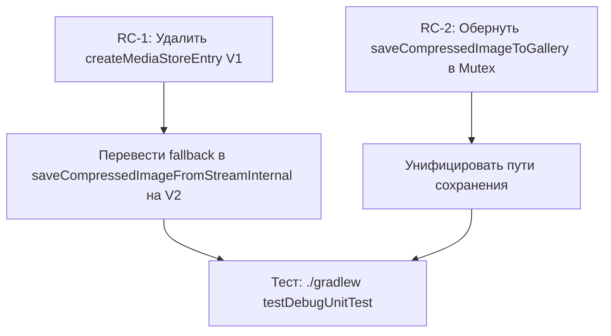

# Аудит гонок состояний в файловых операциях CompressPhotoFast

**Дата:** 2026-06-08  
**Приоритет:** Надёжность > Скорость  
**Область:** Все файловые операции в Android-части приложения

---

## Сводка обнаруженных проблем

| # | Серьёзность | Компонент | Проблема |
|---|------------|-----------|----------|
| RC-1 | 🔴 КРИТИЧЕСКАЯ | MediaStoreUtil | TOCTOU в createMediaStoreEntry (V1): delete→create без Mutex |
| RC-2 | 🔴 КРИТИЧЕСКАЯ | MediaStoreUtil | saveCompressedImageToGallery не защищён Mutex |
| RC-3 | 🟡 ВЫСОКАЯ | ExifUtil | Backup-файл может быть удалён TempFilesCleaner |
| RC-4 | 🟡 ВЫСОКАЯ | ExifUtil | Небезопасное имя backup-файла (timestamp коллизия) |
| RC-5 | 🟡 ВЫСОКАЯ | TempFilesCleaner | Слишком агрессивный паттерн очистки (.jpg/.jpeg) |
| RC-6 | 🟡 ВЫСОКАЯ | FileOperationsUtil.deleteFile | TOCTOU: проверка isProcessing без блокировки |
| RC-7 | 🟢 СРЕДНЯЯ | CompressionBatchTracker | Двойной путь saveCompressedImageTo* через один flow |
| RC-8 | 🟢 СРЕДНЯЯ | SequentialImageProcessor | Scope утечка при resetProcessing во время работы |
| RC-9 | 🟢 СРЕДНЯЯ | UriProcessingTracker | shouldIgnoreUri без синхронизации |
| RC-10 | 🟢 НИЗКАЯ | ImageProcessingUtil | TOCTOU при проверке alreadyQueued |

---

## Детальный разбор проблем и решений

### RC-1: TOCTOU в createMediaStoreEntry (V1) — 🔴 КРИТИЧЕСКАЯ

**Файл:** `MediaStoreUtil.kt:267-286`

**Проблема:** В режиме замены V1-метод удаляет существующий файл (line 273), затем создаёт новую запись (line 289). Между этими двумя операциями другой поток может:
- Создать файл с тем же именем → дубликат
- Начать обработку того же URI → data loss

**Решение:** Удалить V1-метод `createMediaStoreEntry` и перевести все вызовы на V2 (`createMediaStoreEntryV2`), который использует update-in-place вместо delete+create. V2 уже защищён Mutex в `saveCompressedImageFromStream`.

**Вызовов V1:** `saveCompressedImageFromStreamInternal` (fallback line 605) — единственное место. Можно перевести на V2.

---

### RC-2: saveCompressedImageToGallery без Mutex — 🔴 КРИТИЧЕСКАЯ

**Файл:** `MediaStoreUtil.kt:473-531`

**Проблема:** Метод `saveCompressedImageToGallery` вызывает `createMediaStoreEntryV2` и пишет файл **без** захвата Mutex. В отличие от `saveCompressedImageFromStream`, который обёрнут в `saveLock.withLock`. Если два потока вызывают `saveCompressedImageToGallery` для файлов с одинаковым целевым путём — конкурентная запись.

**Решение:** Обернуть тело `saveCompressedImageToGallery` в тот же `saveLock.withLock`:

```kotlin
suspend fun saveCompressedImageToGallery(...) {
    val lockKey = "$targetRelativePath$fileName"
    val saveLock = getSaveLock(lockKey)
    saveLock.withLock {
        saveCompressedImageToGalleryInternal(...)
    }
}
```

Альтернативно — сделать `saveCompressedImageToGallery` приватным и направить все вызовы через `saveCompressedImageFromStream`.

---

### RC-3: Backup-файл EXIF может быть удалён TempFilesCleaner — 🟡 ВЫСОКАЯ

**Файл:** `ExifUtil.kt:860`, `TempFilesCleaner.kt:32-35`

**Проблема:** `ExifUtil.applyExifFromMemory` создаёт backup-файл `exif_backup_*.jpg` в `context.cacheDir`. `TempFilesCleaner.cleanupTempFiles` удаляет файлы с расширением `.jpg` из cacheDir, если они старше `TEMP_FILE_MAX_AGE` (Constants). Но даже если файл новый — паттерн `.endsWith(".jpg")` (line 34-35) захватывает и backup-файлы.

`isFileInUse` через `RandomAccessFile.tryLock()` теоретически защищает, но:
- Файл может быть не залочен в момент проверки (между операциями)
- `TempFilesCleaner` вызывается из `BackgroundMonitoringService` каждые 24 часа, но также может быть вызван явно

**Решение:** Два подхода (рекомендуется оба):

1. Изменить расширение backup-файла на `.bak` вместо `.jpg`:
```kotlin
val backupFile = File(context.cacheDir, "exif_backup_${uri.hashCode()}.bak")
```

2. В `TempFilesCleaner` добавить исключение для `exif_backup_*`:
```kotlin
val isExifBackup = file.name.startsWith("exif_backup_")
// Не удаляем EXIF backup файлы
if (isExifBackup) return@listFiles false
```

---

### RC-4: Небезопасное имя backup-файла EXIF — 🟡 ВЫСОКАЯ

**Файл:** `ExifUtil.kt:860`

**Проблема:** Имя backup-файла `exif_backup_${System.currentTimeMillis()}.jpg`. При параллельной обработке двух изображений (через WorkManager chain), временные метки могут совпадать или быть очень близки, что приведёт к перезаписи backup одного файла другим.

**Решение:** Использовать `URI.hashCode()` + счётчик или UUID:
```kotlin
val backupFile = File(context.cacheDir, "exif_backup_${uri.hashCode()}_${Thread.currentThread().id}.bak")
```

---

### RC-5: TempFilesCleaner — агрессивный паттерн очистки — 🟡 ВЫСОКАЯ

**Файл:** `TempFilesCleaner.kt:32-35`

**Проблема:** Паттерн очистки включает `file.name.endsWith(".jpg")` и `file.name.endsWith(".jpeg")`. Это слишком широко — удаляет ЛЮБЫЕ jpg-файлы в cacheDir, включая потенциально нужные.

```kotlin
val isTempFile = file.name.startsWith("temp_image_") || 
                file.name.startsWith("input_") ||
                file.name.endsWith(".jpg") ||        // ← СЛИШКОМ ШИРОКО
                file.name.endsWith(".jpeg")           // ← СЛИШКОМ ШИРОКО
```

**Решение:** Убрать широкие паттерны `.jpg`/`.jpeg`, оставить только префиксные:
```kotlin
val isTempFile = file.name.startsWith("temp_image_") || 
                file.name.startsWith("input_") ||
                file.name.startsWith("stream_cache") ||
                file.name.startsWith("exif_backup_")  // для очистки после краша
```

Это надёжнее: мы контролируем создание файлов в cacheDir и знаем их префиксы. Пострадает только скорость очистки «забытых» файлов от старых версий, но это маловероятно и менее важно чем надёжность.

---

### RC-6: FileOperationsUtil.deleteFile — TOCTOU — 🟡 ВЫСОКАЯ

**Файл:** `FileOperationsUtil.kt:114-118`

**Проблема:** Проверка `uriProcessingTracker.isProcessing(uri)` выполняется без блокировки. Между проверкой и удалением URI может быть добавлен в обработку другим потоком.

```kotlin
if (!forceDelete && uriProcessingTracker.isProcessing(uri)) {
    return false  // ← здесь uriProcessingTracker не залочен
}
// ... здесь другой поток может начать обработку ...
context.contentResolver.delete(cleanUri, null, null)  // ← DELETE
```

**Решение:** Использовать `addProcessingUriSafe` в режиме try-lock для атомарной проверки:
```kotlin
if (!forceDelete) {
    val mutex = uriProcessingTracker.getMutexForUri(uri)
    if (!mutex.tryLock()) {
        LogUtil.processWarning("deleteFile: URI заблокирован, удаление отменено")
        return false
    }
    try {
        // Выполняем удаление под блокировкой
        context.contentResolver.delete(cleanUri, null, null)
    } finally {
        mutex.unlock()
    }
}
```

Либо, проще — всегда использовать `forceDelete = true` из Worker (что уже делается в line 369) и убрать проверку `isProcessing` из `deleteFile`, оставив её только как soft-check.

---

### RC-7: Двойной путь сохранения — 🟢 СРЕДНЯЯ

**Файл:** `MediaStoreUtil.kt`

**Проблема:** Два метода сохранения:
- `saveCompressedImageToGallery` (из `File`/`temp file`) — без Mutex
- `saveCompressedImageFromStream` (из `InputStream`) — с Mutex

Это создаёт два пути для одного и того же результата. `saveCompressedImageToGallery` используется из `insertImageIntoMediaStore`, который не используется нигде в текущем коде напрямую.

**Решение:** Унифицировать — направить всё через `saveCompressedImageFromStream`. Если `saveCompressedImageToGallery` нужен, обернуть в Mutex (как RC-2).

---

### RC-8: SequentialImageProcessor — Scope утечка — 🟢 СРЕДНЯЯ

**Файл:** `SequentialImageProcessor.kt:211-221`

**Проблема:** `resetProcessing()` отменяет `processingScope` и создаёт новый. Если `processImages` работает в старом scope, он получит `CancellationException`. Но `processingCancelled` — `AtomicBoolean` и может не сброситься атомарно с созданием нового scope.

**Решение:** Добавить в `resetProcessing()` проверку что `processImages` не активен:
```kotlin
fun resetProcessing() {
    processingCancelled.set(true)
    processingScope.cancel()
    processingScope = CoroutineScope(Dispatchers.Default + SupervisorJob())
    _isLoading.value = false
    _progress.value = MultipleImagesProgress()
    _result.value = null
    processingCancelled.set(false)  // Сброс ПОСЛЕ создания нового scope
}
```

---

### RC-9: UriProcessingTracker.shouldIgnoreUri без синхронизации — 🟢 СРЕДНЯЯ

**Файл:** `UriProcessingTracker.kt:263-276`

**Проблема:** `shouldIgnoreUri` читает `ignoreUrisUntil` и `recentlyProcessedUris` без блокировки. ConcurrentHashMap обеспечивает потокобезопасность отдельных операций, но составная проверка (проверить ignore + проверить recentlyProcessed) не атомарна.

**Влияние:** В худшем случае URI будет обработан дважды — что отловится `addProcessingUriSafe` и маркером `CompressPhotoFast_Compressed`.

**Решение:** Текущая защита достаточна (multiple layers of defense). Можно оставить как есть — `addProcessingUriSafe` является final guard.

---

### RC-10: ImageProcessingUtil — TOCTOU при alreadyQueued — 🟢 НИЗКАЯ

**Файл:** `ImageProcessingUtil.kt:92-113`

**Проблема:** Между проверкой `alreadyQueued` и `enqueueUniqueWork` другой поток может enqueue тот же URI. Однако `APPEND_OR_REPLACE` и per-URI tag минимизируют проблему.

**Влияние:** Минимальное — WorkManager дедуплицирует по unique work name.

**Решение:** Не требует изменений. Существующая защита достаточна.

---

## План выполнения

### Приоритет 1 — Критические исправления (RC-1, RC-2)



**Шаги:**
1. В `MediaStoreUtil.saveCompressedImageFromStreamInternal`: заменить вызов `createMediaStoreEntry` (V1) в fallback-ветке на вызов `createMediaStoreEntryV2`
2. Удалить метод `createMediaStoreEntry` (V1)
3. Обернуть `saveCompressedImageToGallery` в Mutex по тому же паттерну что `saveCompressedImageFromStream`
4. Запустить unit-тесты

### Приоритет 2 — Защита EXIF backup (RC-3, RC-4, RC-5)

**Шаги:**
1. Изменить расширение backup-файла в `ExifUtil.applyExifFromMemory` с `.jpg` на `.bak`
2. Использовать `uri.hashCode()` + threadId в имени backup-файла
3. В `TempFilesCleaner`: убрать паттерны `.endsWith(".jpg")` и `.endsWith(".jpeg")`
4. Добавить префиксы `stream_cache*` и `exif_backup_*` в паттерн очистки
5. Запустить unit-тесты

### Приоритет 3 — Усиление deleteFile (RC-6)

**Шаги:**
1. В `FileOperationsUtil.deleteFile`: заменить `isProcessing` check на более надёжный механизм, либо документировать что `forceDelete=true` обязателен при конкурентном доступе
2. Запустить unit-тесты

### Приоритет 4 — Косметические улучшения (RC-7, RC-8, RC-9, RC-10)

**Шаги:**
1. Унифицировать путь сохранения через единый метод
2. Исправить `resetProcessing()` в `SequentialImageProcessor`
3. Запустить unit-тесты

---

## Итоговые изменения по файлам

| Файл | Изменения |
|------|----------|
| `MediaStoreUtil.kt` | Удалить V1, добавить Mutex в saveCompressedImageToGallery |
| `ExifUtil.kt` | Изменить расширение и имя backup-файла |
| `TempFilesCleaner.kt` | Сузить паттерн очистки |
| `FileOperationsUtil.kt` | Усилить защиту deleteFile |
| `SequentialImageProcessor.kt` | Исправить resetProcessing |

---

## Логика процесса выполнения

1. Каждое изменение реализуется последовательно (Приоритет 1 → 2 → 3 → 4)
2. После каждого приоритета — `./gradlew testDebugUnitTest`
3. После всех изменений — полная сборка `./gradlew assembleDebug`
4. Код-ревью через `/local-review-uncommitted`

**Обоснование:** Надёжность критична для приложения, работающего с пользовательскими фотографиями. Повреждение файла хуже чем отказ от его обработки. Все изменения направлены на то, чтобы в случае конкурентного доступа операция безопасно завершалась ошибкой, а не молча портила данные.
