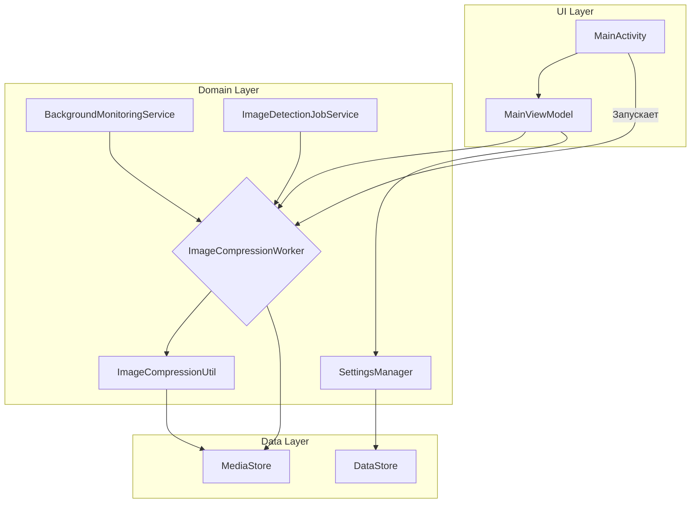
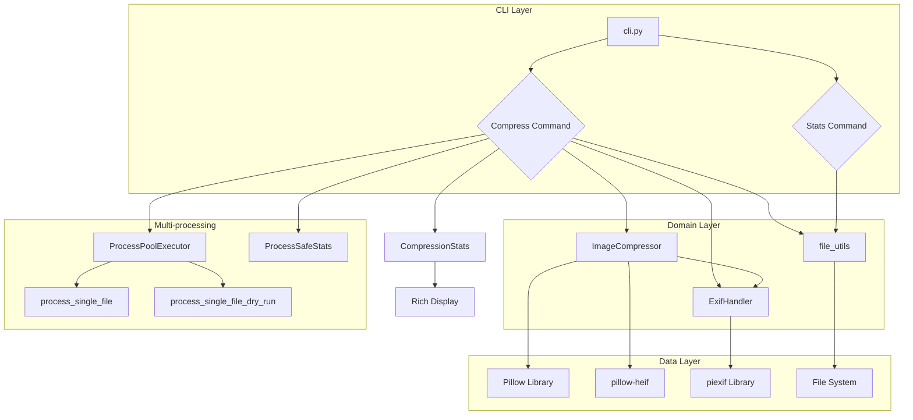

# Архитектура приложения CompressPhotoFast

## Обзор

Приложение построено на основе современных архитектурных компонентов Android и следует паттерну MVVM (Model-View-ViewModel).

## Ключевые компоненты

*   **UI Layer (`app/src/main/java/com/compressphotofast/ui`)**:
    *   `MainActivity.kt`: Единственная Activity в приложении, отвечающая за отображение пользовательского интерфейса и обработку взаимодействий.
    *   `MainViewModel.kt`: ViewModel, которая управляет состоянием UI, обрабатывает бизнес-логику и взаимодействует с репозиториями и сервисами.

*   **Domain Layer**:
    *   Логика сжатия инкапсулирована в `ImageCompressionUtil.kt` и `ImageCompressionWorker.kt`.
    *   `SettingsManager.kt` управляет настройками приложения.
    *   Утилиты в пакете `app/src/main/java/com/compressphotofast/util` предоставляют вспомогательные функции:
        *   **Работа с MediaStore**: `MediaStoreUtil.kt`, `BatchMediaStoreUtil.kt`, `MediaStoreObserver.kt`, `GalleryScanUtil.kt`
        *   **Обработка изображений**: `ImageCompressionUtil.kt`, `ImageProcessingUtil.kt`, `ImageProcessingChecker.kt`, `SequentialImageProcessor.kt`
        *   **Работа с файлами и URI**: `FileOperationsUtil.kt`, `FileInfoUtil.kt`, `UriUtil.kt`, `UriProcessingTracker.kt`
        *   **EXIF-метаданные**: `ExifUtil.kt`
        *   **Отслеживание и статистика**: `CompressionBatchTracker.kt`, `StatsTracker.kt`, `UriProcessingTracker.kt`
        *   **Производительность и кэширование**: `PerformanceMonitor.kt`, `OptimizedCacheUtil.kt`
        *   **Уведомления**: `NotificationUtil.kt`
        *   **Разрешения**: `PermissionsManager.kt`, `IPermissionsManager.kt`
        *   **Очистка**: `TempFilesCleaner.kt`
        *   **Логирование и события**: `LogUtil.kt`, `Event.kt`, `EventObserver.kt`

*   **Data Layer**:
    *   `DataStore` используется для хранения простых настроек.
    *   `MediaStore` используется для доступа к изображениям на устройстве.

## Фоновая обработка

*   **`WorkManager`**: Используется для выполнения задач сжатия изображений в фоновом режиме через `ImageCompressionWorker.kt`. Это обеспечивает надежное выполнение даже после закрытия приложения.
*   **`BackgroundMonitoringService.kt`**: Сервис, который отслеживает новые изображения в фоновом режиме, когда включена функция автоматического сжатия.
*   **`ImageDetectionJobService.kt`**: `JobService`, который периодически проверяет наличие новых изображений.
*   **`BootCompletedReceiver.kt`**: `BroadcastReceiver`, который запускает фоновые службы после перезагрузки устройства.

## Внедрение зависимостей

*   **Hilt**: Используется для внедрения зависимостей во все компоненты приложения, включая `Activity`, `ViewModel` и `Worker`. `AppModule.kt` определяет, как предоставлять зависимости.

## Диаграмма компонентов



## CLI-версия (Linux/Windows)

### Обзор

CLI-версия написана на Python 3.10+ и использует идентичную логику сжатия с Android-приложением. Структура построена на модульном подходе с четким разделением ответственности.

### Ключевые компоненты

*   **CLI Layer (`compressphotofast-cli/src/`)**:
    *   `cli.py`: CLI интерфейс с использованием библиотеки Click. Включает команды `compress`, `stats`, `version` с богатым набором опций.
    *   `__main__.py`: Точка входа для запуска через `python -m src.cli`.

*   **Domain Layer**:
    *   `compression.py`: Класс `ImageCompressor` для сжатия изображений с использованием Pillow. Включает методы тестирования эффективности сжатия, поддержку HEIC/HEIF через pillow-heif.
    *   `exif_handler.py`: Класс `ExifHandler` для работы с EXIF-метаданными с библиотекой piexif. Обеспечивает чтение/запись EXIF, добавление маркеров сжатия, копирование метаданных.
    *   `file_utils.py`: Утилиты для работы с файлами, рекурсивный обход папок, фильтрация изображений (скриншоты, мессенджеры).
    *   `constants.py`: Константы приложения, идентичные Android-версии (уровни качества, размеры файлов, EXIF-маркеры).

*   **Многопроцессорная обработка**:
    *   `multiprocessing_utils.py`: Утилиты для многопроцессорной обработки изображений. Включает `ProcessSafeStats` для process-safe сбора статистики и worker-функции для обработки файлов в отдельных процессах. Использует `ProcessPoolExecutor` с контекстом `spawn` для параллельной обработки.

*   **Статистика и вывод**:
    *   `stats.py`: Класс `CompressionStats` для отслеживания и отображения статистики сжатия с использованием Rich для красивого табличного вывода.

### Структура CLI-проекта

```
compressphotofast-cli/
├── src/
│   ├── __init__.py
│   ├── __main__.py         # Точка входа
│   ├── cli.py              # CLI интерфейс (Click) с многопоточной обработкой
│   ├── compression.py      # Логика сжатия (Pillow + pillow-heif)
│   ├── exif_handler.py     # EXIF метаданные (piexif)
│   ├── file_utils.py       # Утилиты файлов
│   ├── constants.py        # Константы (идентичны Android)
│   ├── stats.py            # Статистика сжатия (Rich)
│   └── multiprocessing_utils.py  # Многопроцессорная обработка
├── requirements.txt         # Зависимости Python
├── setup.py              # Установка через pip
├── pyproject.toml        # Современная конфигурация
├── compressphotofast.sh  # Запуск на Linux/macOS
└── compressphotofast.bat # Запуск на Windows
```

### Интеграция с Android-логикой

*   **Идентичные константы**: Уровни качества (60, 70, 85), минимальный размер файла (100 КБ), минимальная экономия (30%).
*   **Те же EXIF-маркеры**: `CompressPhotoFast_Compressed:quality:timestamp` в теге UserComment (piexif.ExifIFD.UserComment).
*   **Одинаковые правила**: Проверка маркеров, сравнение времени изменения (допустимая разница 20 секунд), пропуск скриншотов и мессенджеров.
*   **Копирование EXIF**: Те же теги (GPS, даты, камера, экспозиция) сохраняются при сжатии.
*   **Поддержка HEIC/HEIF**: Конвертация HEIC/HEIF файлов в JPEG при сжатии (требует pillow-heif).

### Диаграмма CLI-компонентов

