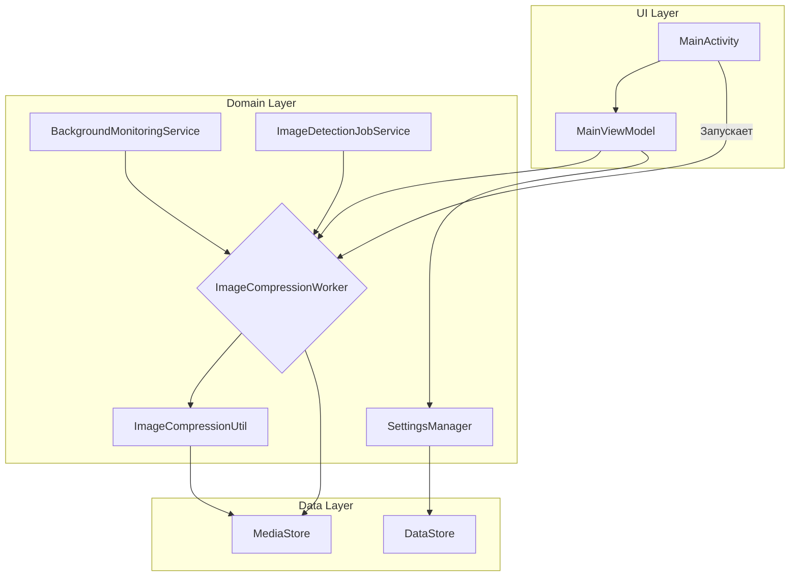
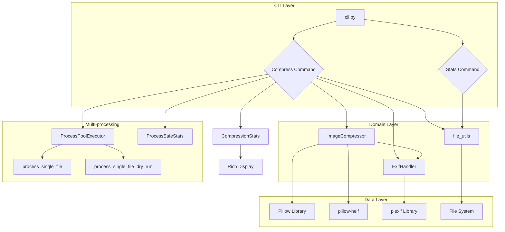

# Архитектура приложения CompressPhotoFast

## Обзор
Приложение построено на основе современных архитектурных компонентов Android и следует паттерну MVVM (Model-View-ViewModel).

## Ключевые компоненты

### UI Layer (`app/src/main/java/com/compressphotofast/ui`)
- `MainActivity.kt`: Единственная Activity в приложении
- `MainViewModel.kt`: ViewModel для управления состоянием UI

### Domain Layer
- Логика сжатия: `ImageCompressionUtil.kt`, `ImageCompressionWorker.kt`
- `SettingsManager.kt`: Управление настройками
- Утилиты в пакете `util` (24 файла):
  - MediaStore: работа с галереей и наблюдение за изменениями
  - Обработка изображений: сжатие, проверка, последовательная обработка
  - Файлы и URI: операции, информация, отслеживание
  - EXIF-метаданные: чтение/запись
  - Статистика и отслеживание: batch tracker, stats tracker
  - Производительность и кэширование
  - Уведомления, разрешения, очистка, логирование

### Data Layer
- `DataStore`: Хранение настроек
- `MediaStore`: Доступ к изображениям на устройстве

## Фоновая обработка
- **WorkManager**: Выполнение задач сжатия через `ImageCompressionWorker.kt`
- **BackgroundMonitoringService.kt**: Отслеживание новых изображений в фоне
- **ImageDetectionJobService.kt**: Периодическая проверка новых изображений
- **BootCompletedReceiver.kt**: Запуск фоновых служб после перезагрузки

## Внедрение зависимостей
- **Hilt**: Внедрение зависимостей во все компоненты (Activity, ViewModel, Worker)

## Тестирование
- **Unit тесты**: `app/src/test/` (JUnit, Robolectric, MockK)
- **Instrumentation тесты**: `app/src/androidTest/` (Espresso, UIAutomator)
- **Базовые классы**: `BaseUnitTest`, `BaseInstrumentedTest`, `CoroutinesTestRule`
- **Инфраструктура**: `TestImageGenerator`, `TestUtilities`, `WorkManagerTestModule`
- **Скрипты**: quick_test.sh, run_all_tests.sh, run_unit_tests.sh, run_instrumentation_tests.sh, run_e2e_tests.sh, run_performance_tests.sh, start_emulator.sh, check_device.sh, generate_test_images.sh
- **JaCoCo**: Отчет покрытия в `app/build/reports/jacoco/jacocoTestReport/html/index.html`
- **Статистика (январь 2026)**: 347 тестов (251 unit + 96 instrumentation), покрытие ~8-10%

## Диаграмма компонентов

## CLI-версия (Linux/Windows)

### Обзор
CLI-версия написана на Python 3.10+ и использует идентичную логику сжатия с Android-приложением.

### Ключевые компоненты
- **CLI Layer**: `cli.py` (Click), `__main__.py`
- **Domain Layer**: `compression.py` (Pillow + pillow-heif), `exif_handler.py` (piexif), `file_utils.py`, `constants.py`
- **Многопроцессорная обработка**: `multiprocessing_utils.py` (ProcessPoolExecutor, ProcessSafeStats)
- **Статистика и вывод**: `stats.py` (Rich)

### Интеграция с Android-логикой
- Идентичные константы: уровни качества (60, 70, 85), минимальный размер (100 КБ), минимальная экономия (30%)
- Те же EXIF-маркеры: `CompressPhotoFast_Compressed:quality:timestamp`
- Одинаковые правила: проверка маркеров, сравнение времени (20 сек), пропуск скриншотов и мессенджеров
- Копирование EXIF: GPS, даты, камера, экспозиция
- Поддержка HEIC/HEIF: конвертация в JPEG (требует pillow-heif)

## Диаграмма CLI-компонентов

