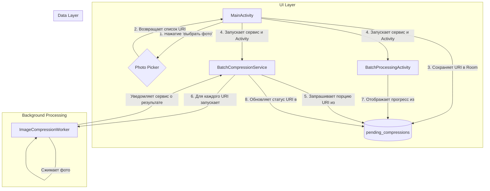

# План реализации массового сжатия изображений

## 1. Проблема

Стандартный механизм Android `Intent.ACTION_SEND_MULTIPLE` не позволяет передавать в приложение более ~500 изображений за раз, что делает невозможным массовое сжатие тысяч фотографий. Необходимо реализовать надежный механизм для обработки 10,000+ изображений за один сеанс.

## 2. Предлагаемая архитектура

Мы реализуем новую, полностью автономную систему массовой обработки внутри приложения, которая не зависит от системных ограничений `Intent`. Система будет основана на следующих компонентах:
- **`Photo Picker`**: для выбора неограниченного количества изображений.
- **База данных `Room`**: для создания персистентной и отказоустойчивой очереди задач на сжатие.
- **`Foreground Service`**: для надежного выполнения длительной фоновой обработки.
- **`Activity` для прогресса**: для информирования пользователя о ходе выполнения задачи.

### Диаграмма решения

## 3. Пошаговый план реализации

### Шаг 1: Анализ и подготовка
- **Статус**: Завершено.
- **Действия**: Изучен существующий код, связанный с обработкой изображений (`MainActivity`, `MainViewModel`, `ImageCompressionWorker`).

### Шаг 2: Интеграция Photo Picker
- **Статус**: Спроектировано.
- **Действия**:
    1.  Добавить зависимость `androidx.activity:activity-result-contracts` в `app/build.gradle.kts`.
    2.  Добавить кнопку "Массовое сжатие" в `activity_main.xml`.
    3.  В `MainActivity.kt` реализовать `ActivityResultLauncher` для `PickMultipleVisualMedia` для получения списка `URI`.

### Шаг 3: Создание базы данных Room
- **Статус**: Спроектировано.
- **Действия**:
    1.  Добавить зависимости `Room` в `app/build.gradle.kts` (анализ показал, что Room в проекте на данный момент не используется).
    2.  Создать `@Entity` `CompressionTask` со полями `id`, `uriString`, `stableId`, `status`, `timestamp`, `failureReason`. `stableId` будет уникальным индексом для предотвращения дубликатов.
    3.  Создать `@Dao` `CompressionTaskDao` с методами для вставки, получения порции задач, обновления статуса и получения `LiveData` для счетчиков.
    4.  Создать класс `@Database` `AppDatabase`.
    5.  Настроить предоставление `AppDatabase` и `CompressionTaskDao` через Hilt в `AppModule.kt`.

### Шаг 4: Разработка BatchCompressionService
- **Статус**: Спроектировано.
- **Действия**:
    1.  Создать `BatchCompressionService`, наследуемый от `Service` и аннотированный `@AndroidEntryPoint`.
    2.  Сервис будет работать в режиме `Foreground`.
    3.  В `onStartCommand` обрабатывать действия `ACTION_START` и `ACTION_STOP`.
    4.  В основном цикле сервиса (в корутине) запрашивать из `Room` порции задач (`batch`) со статусом `PENDING`.
    5.  Для каждой задачи запускать существующий `ImageCompressionWorker`, передавая `URI` и `ID` задачи.
    6.  Зарегистрировать сервис в `AndroidManifest.xml`.

### Шаг 5: Создание BatchProcessingActivity
- **Статус**: Спроектировано.
- **Действия**:
    1.  Создать макет `activity_batch_processing.xml` с `ProgressBar`, `TextView` для счетчиков и кнопкой "Остановить".
    2.  Создать `BatchProcessingViewModel`, который будет получать `LiveData` со статистикой (`totalCount`, `completedCount`, `failedCount`) из `CompressionTaskDao`.
    3.  Создать `BatchProcessingActivity`, которая будет наблюдать за `LiveData` из `ViewModel` и обновлять UI в реальном времени.
    4.  Реализовать логику кнопки "Остановить" для отправки команды `ACTION_STOP` в `BatchCompressionService`.

### Шаг 6: Связывание компонентов
- **Статус**: Спроектировано.
- **Действия**:
    1.  **`MainActivity`**: После получения `URI` от `Photo Picker` передает их в `MainViewModel`.
    2.  **`MainViewModel`**: Генерирует `stableId` для каждого `URI` и сохраняет `CompressionTask` в `Room`.
    3.  **`MainActivity`**: После сохранения запускает `BatchCompressionService` и `BatchProcessingActivity`.
    4.  **`ImageCompressionWorker`**: После завершения сжатия обновляет статус задачи в `Room` по ее `ID`.
    5.  **`BatchProcessingActivity`**: Автоматически обновляет UI благодаря `LiveData` от `Room`.

### Шаг 7: Тестирование
- **Статус**: Спланировано.
- **Действия**:
    - **Unit-тесты**: для `DAO` и генерации `stableId`.
    - **Интеграционные тесты**: для связок `ViewModel-Room`, `Service-Room`, `Worker-Room`.
    - **Ручное тестирование (e2e)**: Сценарии успешной обработки, остановки процесса, "убийства" приложения и перезагрузки устройства.
    - **Стресс-тест**: на 10,000+ изображений для проверки стабильности и потребления памяти.

### Шаг 8: Логика предлагаемых изменений
- **Статус**: Завершено.
- **Итог**: Спроектирована надежная, масштабируемая и отказоустойчивая система для массовой обработки изображений, решающая проблему системных ограничений и обеспечивающая хороший пользовательский опыт.