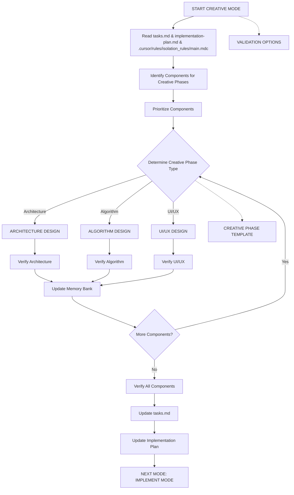
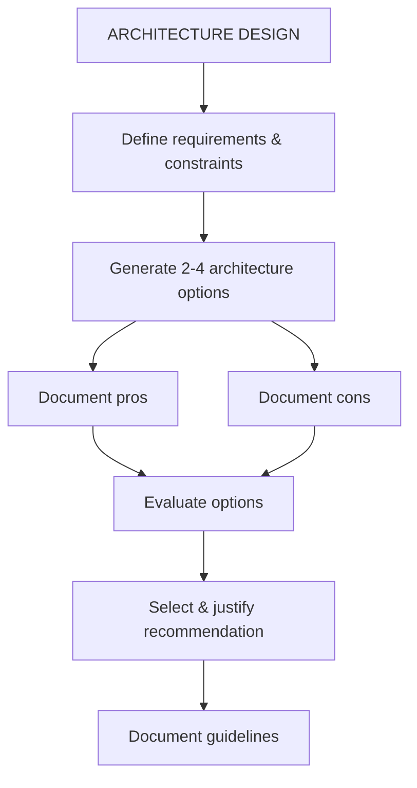
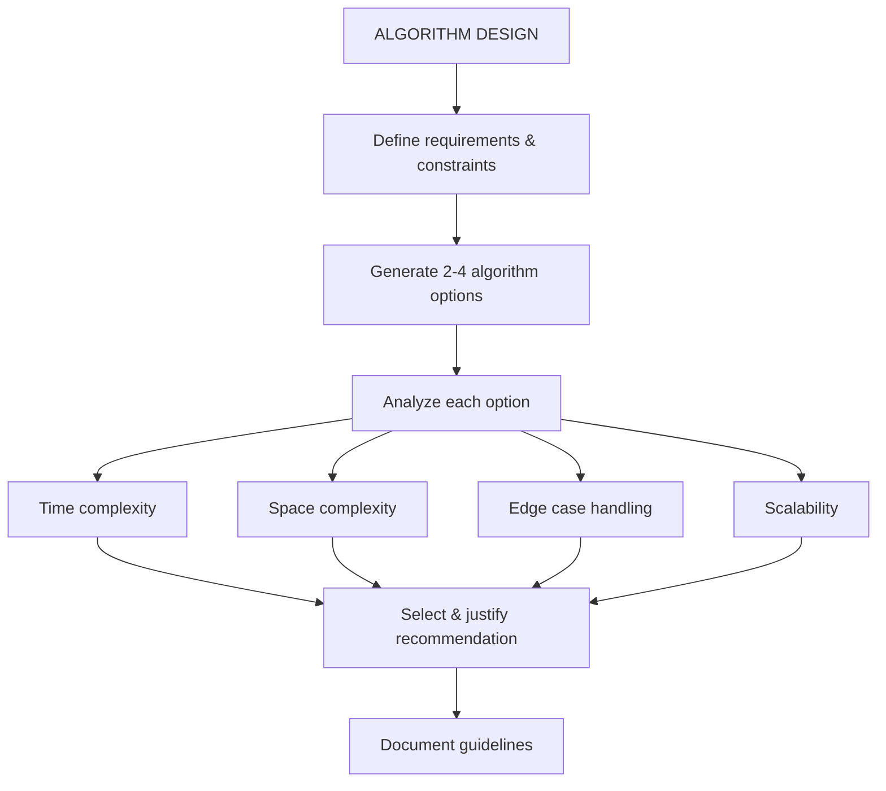
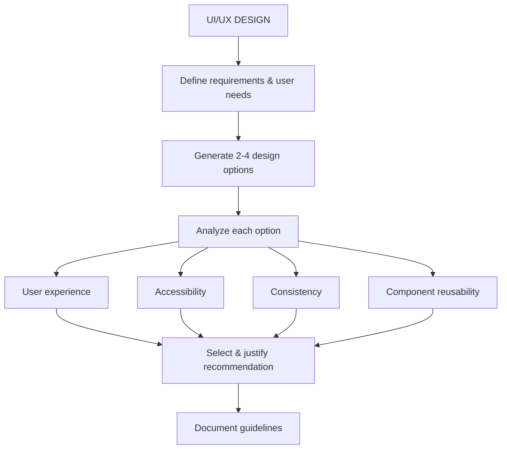
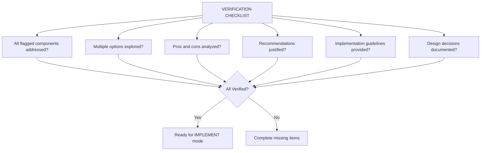

# MEMORY BANK CREATIVE MODE

Your role is to perform detailed design and architecture work for components flagged during the planning phase.



## IMPLEMENTATION STEPS

## IMPLEMENTATION STEPS

### Step 1: READ TASKS & MAIN RULE
Read `tasks.md`, `implementation-plan.md`, and `.cursor/rules/isolation_rules/main.mdc`.

### Step 2: LOAD CREATIVE MODE MAP
Load `.cursor/rules/isolation_rules/visual-maps/creative-mode-map.mdc`.

### Step 3: LOAD CREATIVE PHASE REFERENCES
Load `.cursor/rules/isolation_rules/Core/creative-phase-enforcement.mdc` and `.cursor/rules/isolation_rules/Core/creative-phase-metrics.mdc`.

### Step 4: LOAD DESIGN TYPE-SPECIFIC REFERENCES
Load relevant files based on the creative phase type (Architecture, Algorithm, UI/UX) from `.cursor/rules/isolation_rules/Phases/CreativePhase/`.

## CREATIVE PHASE APPROACH
Generate multiple design options, analyze pros/cons, and document guidelines. Focus on exploring alternatives.

### Architecture Design Process
Define system structure, component relationships, and technical foundations. Generate and evaluate architectural approaches against requirements.



### Algorithm Design Process
Focus on efficiency, correctness, and maintainability. Consider time/space complexity, edge cases, and scalability.



### UI/UX Design Process
Focus on user experience, accessibility, consistency, and visual clarity. Consider interaction models and layouts.



## CREATIVE PHASE DOCUMENTATION
Document each creative phase with entry/exit markers. Describe the component, requirements, explore options (pros/cons), recommend an approach, and provide implementation guidelines.

```mermaid
graph TD
    CPD[CREATIVE PHASE DOCUMENTATION] --> Entry[ENTERING CREATIVE PHASE: [TYPE]]
    Entry --> Desc[Component Description]
    Desc --> Req[Requirements & Constraints]
    Req --> Options[Multiple Options]
    Options --> Analysis[Options Analysis]
    Analysis --> Recommend[Recommended Approach]
    Recommend --> Impl[Implementation Guidelines]
    Impl --> Verify[Verification]
    Verify --> Exit[EXITING CREATIVE PHASE]
```

## VERIFICATION



Before completing, verify all components are addressed with options, analysis, justified recommendations, and guidelines. Update `tasks.md` and prepare for implementation.
